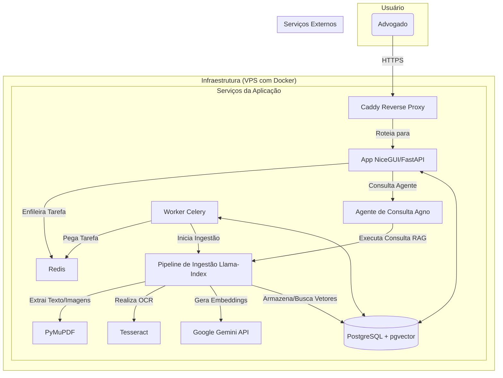

# Documento de Arquitetura Fullstack: Sistema de Agentes Autônomos para Advocacia

| Data | Versão | Descrição | Autor |
| :--- | :--- | :--- | :--- |
| 25/07/2025 | 1.2 | Versão completa e consolidada, incluindo todas as seções. | Winston, Arquiteto |
| 25/07/2025 | 1.3 | Arquitetura de frontend detalhada com base no front-end-spec.md. Estratégia de testes refinada. | Winston, Arquiteto |
| 25/07/2025 | 2.0 | Revisão completa para alinhar com a arquitetura final baseada em Llama-Index e Agno. Atualizado diagrama, stack, esquema de banco de dados e fluxos de trabalho. | Winston, Arquiteto |

## Seção 1: Introdução

Este documento delineia a arquitetura fullstack completa para o "Sistema de Agentes Autônomos para Advocacia", incluindo sistemas de backend, implementação de frontend e sua integração. Ele serve como a única fonte de verdade para o desenvolvimento orientado por IA, garantindo consistência em toda a pilha de tecnologia e alinhamento com o `prd.md` e o `front-end-spec.md`.

### Template Inicial ou Projeto Existente

A abordagem será construir o projeto a partir do zero. Não utilizaremos um template de projeto pré-existente. As decisões de arquitetura serão baseadas nas tecnologias e premissas definidas no PRD.

## Seção 2: Arquitetura de Alto Nível

Esta seção estabelece os fundamentos da arquitetura, descrevendo a abordagem geral, a infraestrutura, a organização do código e os principais padrões que guiarão o desenvolvimento.

### Resumo Técnico

A arquitetura do sistema será modular e orientada a serviços, implementada inteiramente em Python. O frontend será construído com **NiceGUI**. O backend consistirá em uma **API FastAPI**, um sistema de processamento de tarefas assíncronas com **Celery** e **Redis**, e um banco de dados **PostgreSQL** com a extensão **pgvector**. A orquestração do pipeline de RAG (Retrieval-Augmented Generation) será gerenciada pelo **Llama-Index**, que utilizará a **API do Google Gemini** para embeddings e geração de respostas. A camada de agentes autônomos, que consome o pipeline RAG, será construída com o framework **Agno**.

### Estrutura do Repositório

* **Estrutura:** **Monorepo**.
* **Justificativa:** Facilita a manutenção da consistência e o gerenciamento de dependências entre os diferentes serviços e agentes. A biblioteca `python-dependency-injector` será utilizada para reforçar a modularidade e o desacoplamento.

### Diagrama de Arquitetura de Alto Nível


```mermaid
graph TD
    subgraph "Usuário"
        U(Advogado)
    end

    subgraph "Infraestrutura (VPS com Docker)"
        U -- HTTPS --> CADDY[Caddy Reverse Proxy]

        subgraph "Serviços da Aplicação"
            CADDY -- Roteia para --> NICEGUI_APP[App NiceGUI/FastAPI]
            
            NICEGUI_APP -- Enfileira Tarefa --> REDIS[Redis]
            NICEGUI_APP -- Consulta Agente --> AGNO_AGENT[Agente de Consulta Agno]
            
            CELERY_WORKER[Worker Celery] -- Pega Tarefa --> REDIS
            CELERY_WORKER -- Inicia Ingestão --> LLAMA_INDEX_PIPELINE[Pipeline de Ingestão Llama-Index]
            
            LLAMA_INDEX_PIPELINE -- Extrai Texto/Imagens --> PYMUPDF[PyMuPDF]
            LLAMA_INDEX_PIPELINE -- Realiza OCR --> TESSERACT[Tesseract]
            LLAMA_INDEX_PIPELINE -- Gera Embeddings --> GEMINI_API[Google Gemini API]
            LLAMA_INDEX_PIPELINE -- Armazena/Busca Vetores --> DB[(PostgreSQL + pgvector)]

            AGNO_AGENT -- Executa Consulta RAG --> LLAMA_INDEX_PIPELINE
            
            NICEGUI_APP <--> DB
            CELERY_WORKER <--> DB
        end
    end

    subgraph "Serviços Externos"
        GEMINI_API
    end
```
## Seção 3: Stack de Tecnologia

Esta tabela é a fonte definitiva de verdade para todas as tecnologias e suas versões que serão utilizadas no projeto.

| Categoria | Tecnologia | Versão | Propósito | Justificativa |
| :--- | :--- | :--- | :--- | :--- |
| **Linguagem** | Python | 3.12.x | Linguagem principal do projeto. | Requisito do PRD (NFR4). |
| **Framework Web (UI)** | NiceGUI | 1.4+ | Construção da interface de usuário interativa. | Requisito do PRD (NFR4). |
| **Framework Web (API)** | FastAPI | 0.104+ | Servir a API RESTful para o frontend e clientes. | Padrão de mercado, integrado ao NiceGUI. |
| **Banco de Dados** | PostgreSQL | 16.x | Armazenamento de dados relacionais (usuários, clientes, documentos). | Requisito do PRD (NFR5). |
| **Extensão Vetorial** | pgvector | 0.7.x | Habilita o armazenamento e a busca de similaridade de vetores. | Requisito do PRD (NFR5). |
| **Processamento Assíncrono**| Celery | 5.3+ | Fila de tarefas para processar PDFs de forma assíncrona. | Padrão da indústria para tarefas em background. |
| **Message Broker** | Redis | 7.2.x | Broker para Celery e cache de estado de tarefas. | Rápido, confiável e padrão para Celery. |
| **IA Generativa** | Google Gemini API | v1.5 | Geração de embeddings e síntese de respostas. | Requisito do PRD (NFR6). |
| **Orquestração de RAG**| Llama-Index | 0.12.x | Orquestra todo o pipeline de ingestão e consulta RAG. | Abstrai a complexidade do RAG. |
| **Framework de Agentes** | Agno | 1.7.x | Estrutura para a criação dos agentes autônomos que consomem o RAG. | Especializado na criação de agentes com ferramentas. |
| **Manipulação de PDF** | PyMuPDF | 1.24+ | Extração de texto e imagens de arquivos PDF. | Performance e robustez. Licença AGPL. |
| **OCR** | Tesseract | 5.5.x | Extração de texto de imagens (documentos escaneados). | Solução open-source robusta, usada pelo Llama-Index. |
| **Injeção de Dependência**| dependency-injector | 4.48.x| Gerenciamento de modularidade e dependências. | Facilita testes e desacoplamento. |
| **ORM & Migrações** | SQLAlchemy & Alembic | 2.x | Mapeamento Objeto-Relacional e migrações de esquema. | Padrão para gestão de esquema de BD em Python. |
| **Conteinerização** | Docker & Docker Compose | 29.x | Empacotamento e orquestração dos serviços. | Consistência e portabilidade do ambiente. |
| **Proxy Reverso** | Caddy | 2.10.x | Roteamento de tráfego e gerenciamento automático de SSL/TLS. | Simplicidade e segurança. |

## Seção 4: Modelos de Dados

Os modelos de dados, definidos com SQLAlchemy, refletem a estrutura necessária para a aplicação e para a integração com o Llama-Index.

* **User:** Gerencia usuários e seus papéis (`sysadmin`, `admin_user`, `common_user`).
* **Client:** Armazena informações dos clientes do escritório.
* **Document:** Rastreia metadados e status dos arquivos PDF enviados.
* **DocumentChunk:** Armazena os nós (chunks) de texto vetorizados, compatível com o `PGVectorStore` do Llama-Index.

## Seção 5: Especificação da API

A aplicação exporá uma API RESTful via FastAPI para gerenciar recursos e interagir com os agentes.

* `POST /v1/documents`: Faz o upload de um PDF, que dispara uma tarefa assíncrona de ingestão via Celery e Llama-Index.
* `GET /v1/tasks/{task_id}`: Verifica o status de uma tarefa de processamento.
* `POST /v1/query`: Envia uma pergunta para o agente de consulta (Agno), que utilizará o pipeline RAG (Llama-Index) para responder.

## Seção 6: Componentes

O sistema é decomposto nos seguintes componentes lógicos, implementados como serviços Docker:

* **Reverse Proxy (Caddy):** Ponto de entrada da aplicação, gerencia tráfego e TLS.
* **Web Application (NiceGUI/FastAPI):** Serve a interface do usuário e os endpoints da API.
* **Task Queue (Celery + Redis):** Gerencia o enfileiramento de tarefas de processamento de documentos.
* **Processing Worker (Celery Worker):** Executa as tarefas da fila, invocando o pipeline de ingestão do Llama-Index.
* **RAG Pipeline (Llama-Index):** Componente lógico (não um serviço separado) que orquestra a extração, chunking, embedding e armazenamento de dados.
* **Query Agent (Agno):** Componente lógico que encapsula a lógica de consulta, utilizando o RAG pipeline como uma ferramenta.
* **Database (PostgreSQL + pgvector):** Camada de persistência para dados relacionais e vetoriais.

## Seção 7: APIs Externas

A única dependência externa de API é a da **Google para o modelo Gemini**, que é utilizada pelo Llama-Index para gerar embeddings e sintetizar respostas.

## Seção 8: Fluxos de Trabalho Principais

*   **Ingestão de Documento (Assíncrono):**
    1.  Usuário faz upload de um PDF via UI (NiceGUI).
    2.  A API (FastAPI) recebe o arquivo e enfileira uma tarefa no Celery.
    3.  O Worker Celery pega a tarefa e invoca o pipeline de ingestão do **Llama-Index**.
    4.  O Llama-Index lê o PDF, extrai o texto (usando OCR se necessário), o divide em chunks, gera embeddings via Gemini e os armazena no PostgreSQL/pgvector.
*   **Consulta via Agente de IA (Síncrono):**
    1.  Usuário envia uma pergunta através da UI.
    2.  A API delega a pergunta para o agente de consulta (Agno).
    3.  O agente Agno utiliza sua ferramenta de busca, que invoca o **Query Engine do Llama-Index**.
    4.  O Llama-Index converte a pergunta em um vetor, busca os chunks mais relevantes no pgvector (com filtro por cliente), e envia o contexto e a pergunta para o Gemini sintetizar a resposta.
    5.  A resposta final é retornada ao usuário.

## Seção 9: Esquema e Migrações do Banco de Dados

### Esquema do Banco de Dados (Single-Tenant)

O esquema para o PostgreSQL é projetado para ser compatível com o `PGVectorStore` do Llama-Index.

```sql
-- Extensões necessárias
CREATE EXTENSION IF NOT EXISTS "pgcrypto";
CREATE EXTENSION IF NOT EXISTS "vector";

-- Tabela de usuários
CREATE TABLE users (
    id UUID PRIMARY KEY DEFAULT gen_random_uuid(),
    username VARCHAR(255) UNIQUE NOT NULL,
    hashed_password VARCHAR(255) NOT NULL,
    role VARCHAR(50) NOT NULL,
    is_active BOOLEAN DEFAULT TRUE,
    created_at TIMESTAMPTZ DEFAULT NOW(),
    updated_at TIMESTAMPTZ DEFAULT NOW()
);

-- Tabela de clientes
CREATE TABLE clients (
    id UUID PRIMARY KEY DEFAULT gen_random_uuid(),
    owner_id UUID NOT NULL REFERENCES users(id),
    name VARCHAR(255) NOT NULL,
    cpf VARCHAR(14) UNIQUE NOT NULL,
    date_of_birth DATE NOT NULL,
    created_at TIMESTAMPTZ DEFAULT NOW(),
    updated_at TIMESTAMPTZ DEFAULT NOW()
);

-- Tabela de documentos
CREATE TABLE documents (
    id UUID PRIMARY KEY DEFAULT gen_random_uuid(),
    client_id UUID NOT NULL REFERENCES clients(id) ON DELETE CASCADE,
    content_hash VARCHAR(64) NOT NULL,
    original_filename TEXT NOT NULL,
    status VARCHAR(50) NOT NULL DEFAULT 'queued',
    classification VARCHAR(50) NOT NULL,
    uploaded_at TIMESTAMPTZ DEFAULT NOW(),
    UNIQUE (client_id, content_hash)
);

-- Tabela de chunks para Llama-Index PGVectorStore
CREATE TABLE document_chunks (
    node_id VARCHAR PRIMARY KEY,
    embedding VECTOR(768),
    text TEXT NOT NULL,
    metadata JSONB NOT NULL,
    document_id UUID REFERENCES documents(id) ON DELETE CASCADE
);

-- Índices para performance
CREATE INDEX ix_document_chunks_document_id ON document_chunks (document_id);
CREATE INDEX ix_documents_client_id ON documents (client_id);
CREATE INDEX ix_documents_status ON documents (status);
-- Índice HNSW para busca vetorial
CREATE INDEX idx_document_chunks_embedding ON document_chunks USING hnsw (embedding vector_cosine_ops);
```
### Gerenciamento de Migrações

Utilizaremos **Alembic** com **SQLAlchemy** para gerenciar as alterações no esquema do banco de dados de forma versionada e segura.

## Seção 10: Arquitetura de Frontend (com NiceGUI)

A UI será construída com padrões modulares em Python, estritamente alinhados com o `front-end-spec.md` e utilizando os componentes nativos do NiceGUI para implementar os layouts e fluxos de usuário definidos.

## Seção 11: Arquitetura de Backend (Single-Tenant)

Adotaremos o **Padrão de Repositório** para acesso a dados e **Serviços Modulares** para a lógica de negócio, com todas as dependências gerenciadas pelo `python-dependency-injector`. A autorização será baseada em papéis (RBAC).

## Seção 12: Estrutura Unificada do Projeto (Monorepo)

A estrutura de diretórios reflete a separação de responsabilidades, com pastas claras para a aplicação (`app`), documentos (`docs`), testes (`tests`), etc., conforme detalhado no `docker.md`.

```plaintext
/sistema-advocacia-saas/
├── app/
│   ├── api/
│   ├── agents/
│   ├── core/
│   ├── models/
│   ├── repositories/
│   ├── services/
│   ├── ui_components/
│   ├── workers/
│   ├── containers.py
│   └── main.py
├── docs/
├── tests/
├── .env.example
├── Caddyfile
├── docker-compose.yml
├── Dockerfile
├── pyproject.toml
└── README.md
```
## Seção 13: Fluxo de Trabalho de Desenvolvimento

O ambiente de desenvolvimento será totalmente gerenciado pelo Docker Compose, conforme especificado no `docker.md`.

## Seção 14: Arquitetura de Implantação (Deployment)

A implantação em um VPS dedicado seguirá o modelo single-tenant, automatizada com ferramentas de IaC e um pipeline de CI/CD.

## Seção 15: Segurança e Performance

A segurança será garantida por HTTPS via Caddy, gerenciamento de segredos, RBAC e encapsulamento de serviços. A performance é otimizada pelo uso de Celery para tarefas assíncronas e índices HNSW no pgvector.

## Seção 16: Estratégia de Testes

A estratégia de testes seguirá a pirâmide de testes completa (Unitários, Integração, E2E) definida no PRD, utilizando `pytest` e o framework de testes nativo do NiceGUI com Playwright.

## Seção 17: Padrões de Código

Seguiremos o padrão PEP 8 com formatação por `Black` e linting por `Ruff`. O uso de *type hints* será obrigatório.

## Seção 18: Tratamento de Erros

A aplicação terá uma estratégia de tratamento de erros em camadas, com *exception handlers* no FastAPI, exceções customizadas nos serviços e políticas de retentativa (`retry`) nos workers Celery.

## Seção 19: Monitoramento (Simplificado)

A V1 focará em monitoramento enxuto: logs estruturados, um endpoint de health check e monitoramento da fila Celery via Flower.

## Seção 20: Estratégia Operacional do VPS

A saúde do servidor e os backups automatizados serão gerenciados pelos recursos nativos do provedor de VPS.
