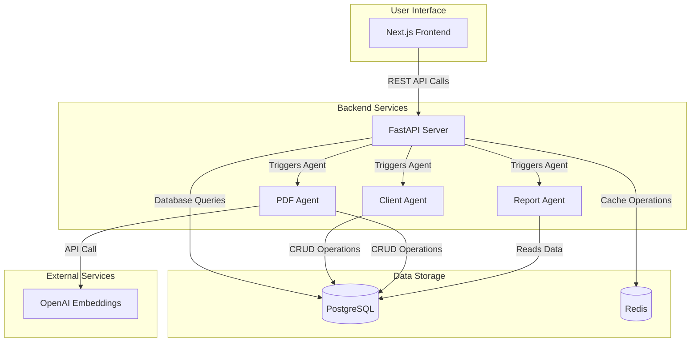

# Components

Major logical components across the fullstack system with clear boundaries and interfaces:

### Frontend Components

#### Component Interaction Diagram

#### Authentication Component
**Responsibility:** Handle user login, 2FA verification, and session management with secure token storage

**Key Interfaces:**
- LoginForm: Email/password authentication interface
- TwoFactorAuth: TOTP code verification interface  
- AuthContext: React context for authentication state management
- AuthGuard: Route protection component for role-based access

**Technology Stack:** Next.js 15 App Router, React 19 Context, TanStack Query for auth state, Zod validation

#### Client Management Component
**Responsibility:** Complete CRUD operations for client data with search, filtering, and bulk operations

**Key Interfaces:**
- ClientList: Paginated table with search and filtering
- ClientForm: Create/edit client information with validation
- ClientDetail: Individual client profile view with audit history
- BulkOperations: Multi-select actions and CSV import/export

**Technology Stack:** shadcn/ui Table components, React Hook Form with Zod validation, TanStack Query for data fetching

#### Custom Branding Component
**Responsibility:** Real-time visual branding customization using CSS variables and asset management

**Key Interfaces:**
- BrandingPanel: Color scheme and typography customization
- AssetUploader: Logo and favicon management
- ThemePreview: Real-time preview of branding changes
- BrandExporter: Save and deploy branding configurations

**Technology Stack:** Tailwind CSS variables, shadcn/ui theming system, React color picker components

### Backend Components

#### FastAPI Core Application
**Responsibility:** Central API server handling authentication, routing, middleware, and core business logic

**Key Interfaces:**
- REST API endpoints following OpenAPI 3.0 specification
- JWT authentication middleware with role-based access control
- Request/response validation using Pydantic models
- CORS and security headers configuration

**Technology Stack:** FastAPI 0.115+, SQLModel ORM, Pydantic validation, Uvicorn ASGI server

#### Database Access Layer
**Responsibility:** Centralized data access with SQLModel ORM, connection pooling, and transaction management

**Key Interfaces:**
- ClientRepository: CRUD operations for client data
- UserRepository: User management and authentication queries
- AuditRepository: Audit trail logging and retrieval
- Database session management and connection pooling

**Technology Stack:** SQLModel ORM, asyncpg PostgreSQL driver, Alembic migrations

### Agent Components (Independent)

#### Client Management Agent (Agent 1)
**Responsibility:** Autonomous client data operations with validation, deduplication, and audit trail integration

**Key Interfaces:**
- Client registration with SSN validation and duplicate prevention
- Advanced search and filtering capabilities
- Bulk operations for data import/export
- Direct database access to clients table

**Technology Stack:** Agno framework, SQLModel for database access, Pydantic validation

#### PDF Processing Agent (Agent 2)  
**Responsibility:** Document upload, RAG processing with vector embeddings, and searchable document management

**Key Interfaces:**
- File upload processing with validation
- PDF text extraction and chunking
- Vector embedding generation and storage
- Document search and retrieval via vector similarity

**Technology Stack:** Agno framework, pgvector extension, PyPDF2 for text extraction, OpenAI embeddings
