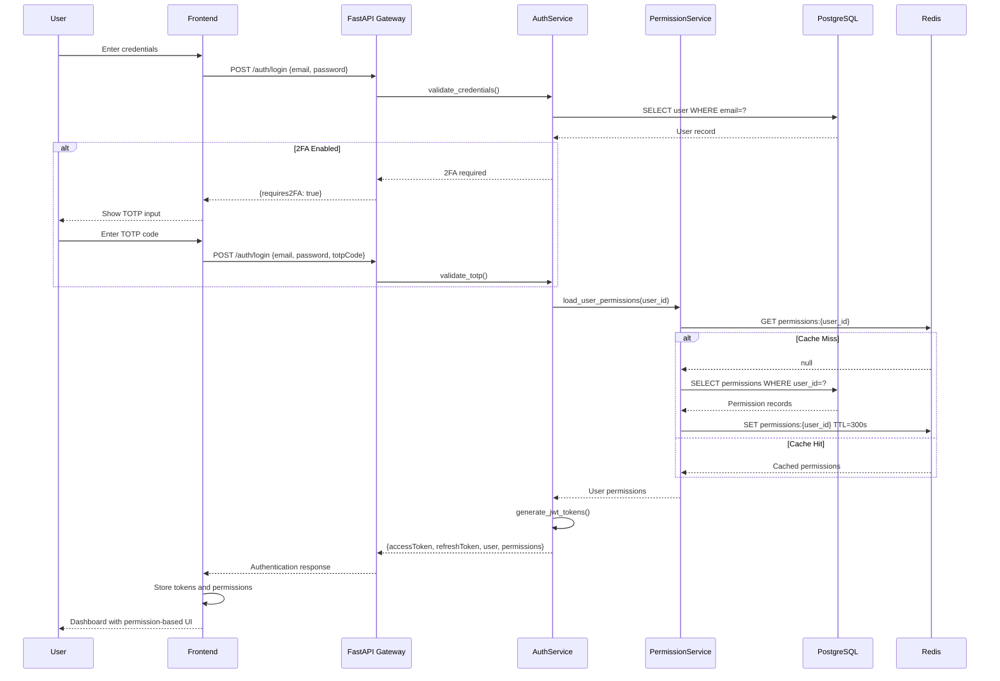
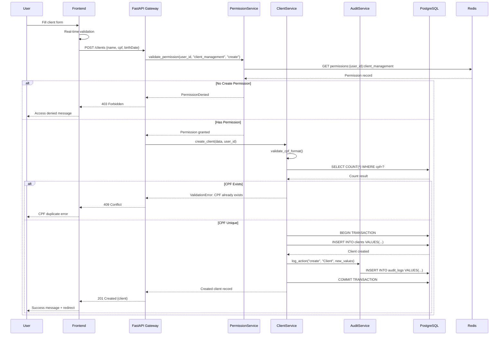

# Core Workflows

The following sequence diagrams illustrate key system workflows that clarify architecture decisions and complex interactions across the fullstack system:

## User Authentication with 2FA and Permission Loading

## Client Creation with Permission Validation and Audit Trail

---
