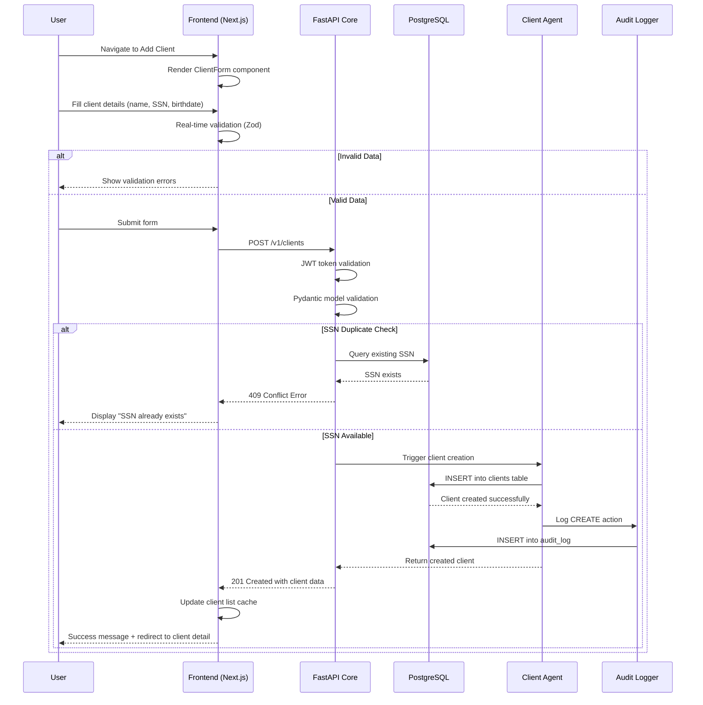
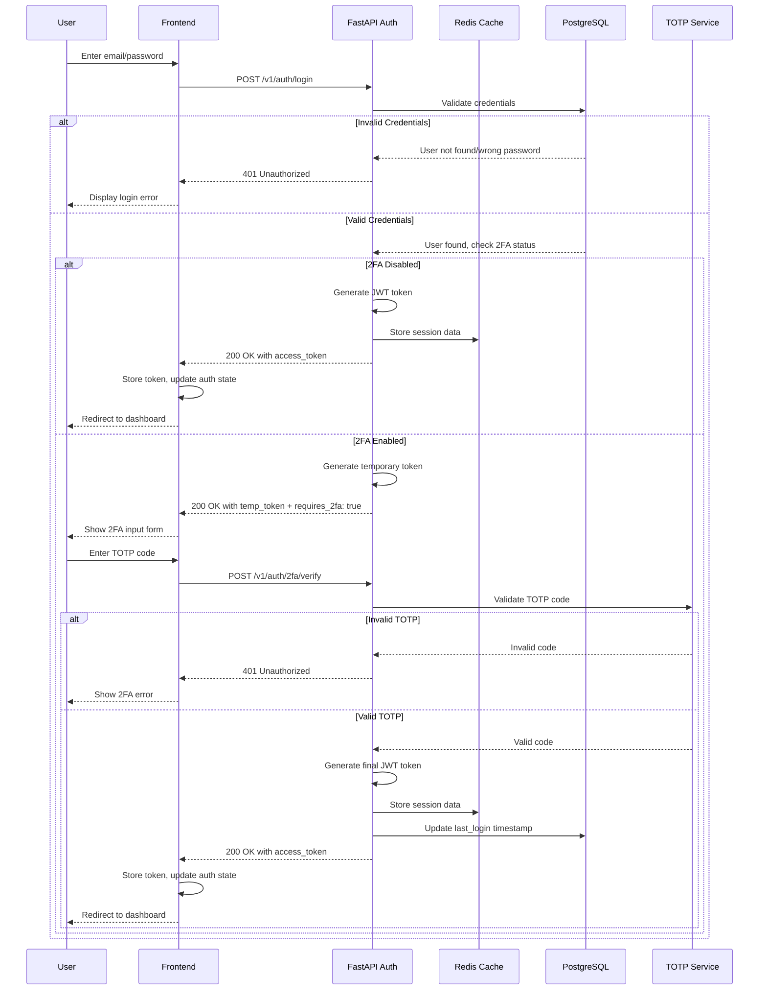

# Core Workflows

Key system workflows using sequence diagrams showing component interactions, including both frontend and backend flows with error handling paths.

### Client Registration Workflow

```mermaid
sequenceDiagram
    participant U as User
    participant F as Frontend (Next.js)
    participant API as FastAPI Core
    participant DB as PostgreSQL
    participant A1 as Client Agent
    participant AL as Audit Logger

    U->>F: Navigate to Add Client
    F->>F: Render ClientForm component
    U->>F: Fill client details (name, SSN, birthdate)
    F->>F: Real-time validation (Zod)
    
    alt Invalid Data
        F-->>U: Show validation errors
    else Valid Data
        U->>F: Submit form
        F->>API: POST /v1/clients
        API->>API: JWT token validation
        API->>API: Pydantic model validation
        
        alt SSN Duplicate Check
            API->>DB: Query existing SSN
            DB-->>API: SSN exists
            API-->>F: 409 Conflict Error
            F-->>U: Display "SSN already exists"
        else SSN Available
            API->>A1: Trigger client creation
            A1->>DB: INSERT into clients table
            DB-->>A1: Client created successfully
            A1->>AL: Log CREATE action
            AL->>DB: INSERT into audit_log
            A1-->>API: Return created client
            API-->>F: 201 Created with client data
            F->>F: Update client list cache
            F-->>U: Success message + redirect to client detail
        end
    end
```

### Authentication with 2FA Workflow

```mermaid
sequenceDiagram
    participant U as User
    participant F as Frontend
    participant API as FastAPI Auth
    participant Redis as Redis Cache
    participant DB as PostgreSQL
    participant TOTP as TOTP Service

    U->>F: Enter email/password
    F->>API: POST /v1/auth/login
    API->>DB: Validate credentials
    
    alt Invalid Credentials
        DB-->>API: User not found/wrong password
        API-->>F: 401 Unauthorized
        F-->>U: Display login error
    else Valid Credentials
        DB-->>API: User found, check 2FA status
        
        alt 2FA Disabled
            API->>API: Generate JWT token
            API->>Redis: Store session data
            API-->>F: 200 OK with access_token
            F->>F: Store token, update auth state
            F-->>U: Redirect to dashboard
        else 2FA Enabled
            API->>API: Generate temporary token
            API-->>F: 200 OK with temp_token + requires_2fa: true
            F-->>U: Show 2FA input form
            
            U->>F: Enter TOTP code
            F->>API: POST /v1/auth/2fa/verify
            API->>TOTP: Validate TOTP code
            
            alt Invalid TOTP
                TOTP-->>API: Invalid code
                API-->>F: 401 Unauthorized
                F-->>U: Show 2FA error
            else Valid TOTP
                TOTP-->>API: Valid code
                API->>API: Generate final JWT token
                API->>Redis: Store session data
                API->>DB: Update last_login timestamp
                API-->>F: 200 OK with access_token
                F->>F: Store token, update auth state
                F-->>U: Redirect to dashboard
            end
        end
    end
```
