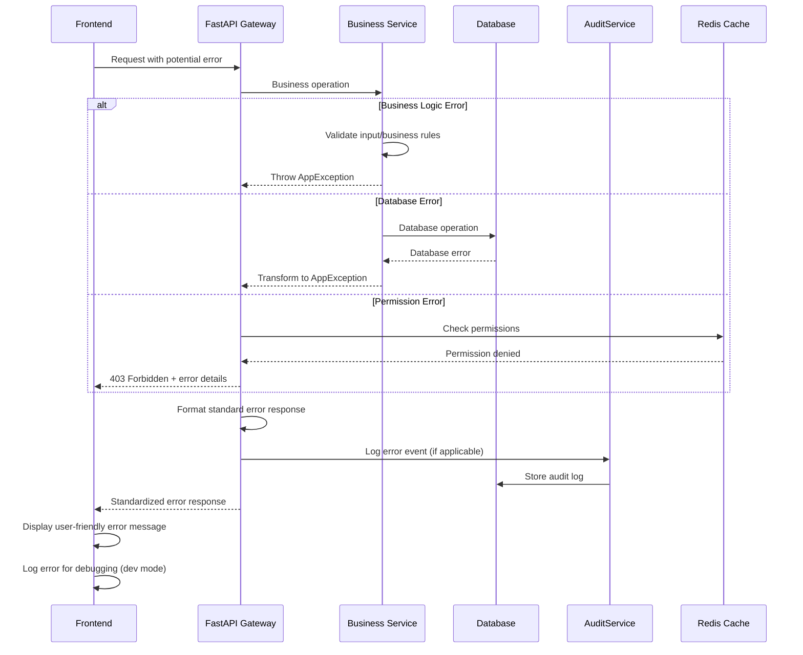

# Error Handling Strategy

The unified error handling strategy ensures consistent user experience and debugging capabilities across the revolutionary agent-based permission system and multi-client deployment architecture.

## Error Flow



## Error Response Format

### Standardized Error Interface
```typescript
// packages/shared/src/types/error.ts
export interface ApiError {
  error: {
    code: string;
    message: string;
    details?: Record<string, any>;
    timestamp: string;
    requestId: string;
  };
}

export enum ErrorCode {
  // Authentication & Authorization
  AUTHENTICATION_FAILED = 'AUTHENTICATION_FAILED',
  INSUFFICIENT_PERMISSIONS = 'INSUFFICIENT_PERMISSIONS',
  TOKEN_EXPIRED = 'TOKEN_EXPIRED',
  TWO_FACTOR_REQUIRED = 'TWO_FACTOR_REQUIRED',
  
  // Validation Errors
  VALIDATION_ERROR = 'VALIDATION_ERROR',
  INVALID_CPF_FORMAT = 'INVALID_CPF_FORMAT',
  DUPLICATE_RESOURCE = 'DUPLICATE_RESOURCE',
  RESOURCE_NOT_FOUND = 'RESOURCE_NOT_FOUND',
  
  // Business Logic Errors
  PERMISSION_ASSIGNMENT_CONFLICT = 'PERMISSION_ASSIGNMENT_CONFLICT',
  CLIENT_HAS_DEPENDENCIES = 'CLIENT_HAS_DEPENDENCIES',
  AGENT_COMMUNICATION_ERROR = 'AGENT_COMMUNICATION_ERROR',
  
  // System Errors
  DATABASE_ERROR = 'DATABASE_ERROR',
  CACHE_ERROR = 'CACHE_ERROR',
  EXTERNAL_SERVICE_ERROR = 'EXTERNAL_SERVICE_ERROR',
  RATE_LIMIT_EXCEEDED = 'RATE_LIMIT_EXCEEDED'
}

// Localized error messages for Brazilian Portuguese UI
export const ErrorMessages: Record<ErrorCode, string> = {
  [ErrorCode.AUTHENTICATION_FAILED]: 'Credenciais inválidas. Verifique seu email e senha.',
  [ErrorCode.INSUFFICIENT_PERMISSIONS]: 'Você não tem permissão para realizar esta ação.',
  [ErrorCode.TOKEN_EXPIRED]: 'Sua sessão expirou. Faça login novamente.',
  [ErrorCode.TWO_FACTOR_REQUIRED]: 'Código de autenticação de dois fatores obrigatório.',
  [ErrorCode.VALIDATION_ERROR]: 'Dados inválidos fornecidos.',
  [ErrorCode.INVALID_CPF_FORMAT]: 'Formato de CPF inválido. Use apenas números.',
  [ErrorCode.DUPLICATE_RESOURCE]: 'Este recurso já existe no sistema.',
  [ErrorCode.RESOURCE_NOT_FOUND]: 'Recurso não encontrado.',
  [ErrorCode.PERMISSION_ASSIGNMENT_CONFLICT]: 'Conflito na atribuição de permissões.',
  [ErrorCode.CLIENT_HAS_DEPENDENCIES]: 'Cliente possui dependências e não pode ser removido.',
  [ErrorCode.AGENT_COMMUNICATION_ERROR]: 'Erro de comunicação entre agentes.',
  [ErrorCode.DATABASE_ERROR]: 'Erro interno do banco de dados.',
  [ErrorCode.CACHE_ERROR]: 'Erro no sistema de cache.',
  [ErrorCode.EXTERNAL_SERVICE_ERROR]: 'Erro em serviço externo.',
  [ErrorCode.RATE_LIMIT_EXCEEDED]: 'Limite de requisições excedido. Tente novamente em alguns minutos.'
};
```

---
