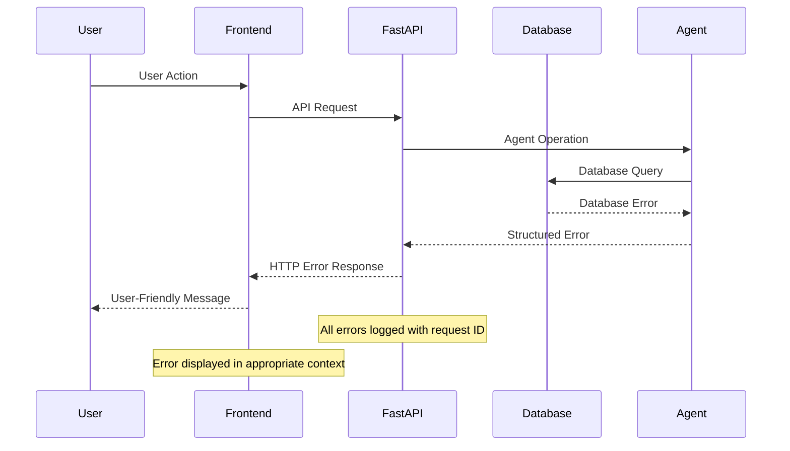

# Error Handling Strategy

The platform implements **unified error handling** across the entire fullstack multi-agent system, ensuring consistent error responses, proper logging, and graceful failure handling.

### Error Flow


```mermaid
sequenceDiagram
    participant U as User
    participant F as Frontend
    participant A as FastAPI
    participant D as Database
    participant AG as Agent
    
    U->>F: User Action
    F->>A: API Request
    A->>AG: Agent Operation
    AG->>D: Database Query
    D-->>AG: Database Error
    AG-->>A: Structured Error
    A-->>F: HTTP Error Response
    F-->>U: User-Friendly Message
    
    Note over A: All errors logged with request ID
    Note over F: Error displayed in appropriate context
```

### Error Response Format

All API errors follow a consistent JSON structure for predictable frontend handling:

```typescript
interface ApiError {
  error: {
    code: string;           // Machine-readable error code
    message: string;        // Human-readable message
    details?: Record<string, any>; // Additional context
    timestamp: string;      // ISO timestamp
    requestId: string;      // Unique request identifier
    agent?: string;         // Which agent generated the error
  };
}

// Example error responses
{
  "error": {
    "code": "VALIDATION_ERROR",
    "message": "Invalid CPF format provided",
    "details": {
      "field": "cpf",
      "received": "123456789",
      "expected": "XXX-XX-XXXX format"
    },
    "timestamp": "2025-08-01T10:30:00Z",
    "requestId": "req_1234567890",
    "agent": "agent1"
  }
}
```
