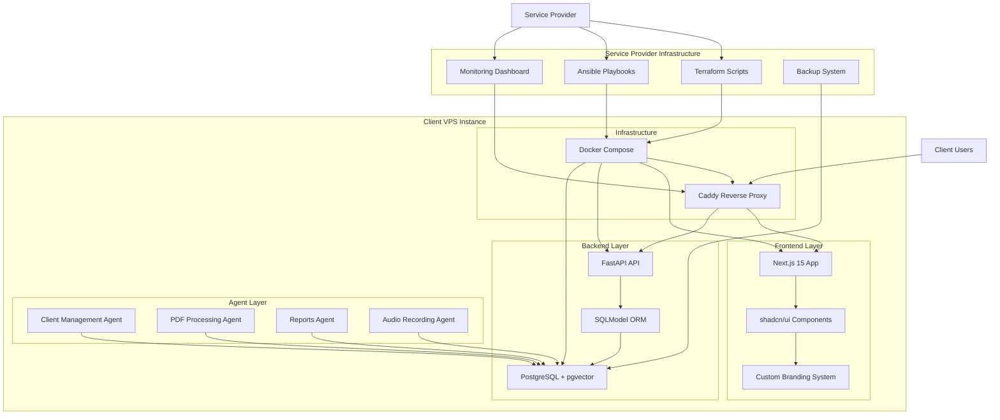

# High Level Architecture

### Technical Summary

The Multi-Agent IAM Dashboard implements a **Custom Implementation Service** architecture delivering dedicated VPS instances with complete brand customization. The system uses a **monolithic core platform** (FastAPI backend + Next.js 15 frontend) supporting **independent AI agents** that communicate through a shared PostgreSQL database. Each client receives their own isolated VPS deployment with full visual branding integration via CSS variables and shadcn/ui theming. The infrastructure leverages **automated deployment pipelines** using Terraform for VPS provisioning and Ansible for configuration management, enabling consistent 3-4 week implementation cycles that justify premium pricing through complete customization.

### Platform and Infrastructure Choice

**Platform**: **Custom VPS + AWS/DigitalOcean Hybrid**

**Core Services**:
- **VPS Providers**: DigitalOcean Droplets or AWS EC2 for client instances
- **DNS Management**: Cloudflare for domain automation and SSL
- **Monitoring**: DataDog or AWS CloudWatch for multi-instance monitoring
- **Backup Storage**: AWS S3 or Backblaze B2 for cross-region backup storage
- **Container Registry**: Docker Hub or AWS ECR for image management

**Deployment Host and Regions**: Multi-region deployment (US-East, US-West, EU-West) based on client geographic requirements

### Repository Structure

**Structure**: **Monorepo with Workspaces**
**Monorepo Tool**: **npm workspaces** (simpler than Nx/Turborepo for this scale)
**Package Organization**: **Feature-based separation with shared utilities**

### High Level Architecture Diagram

```mermaid
graph TB
    subgraph "Client VPS Instance"
        subgraph "Frontend Layer"
            A[Next.js 15 App] --> B[shadcn/ui Components]
            B --> C[Custom Branding System]
        end
        
        subgraph "Backend Layer"
            D[FastAPI API] --> E[SQLModel ORM]
            E --> F[PostgreSQL + pgvector]
        end
        
        subgraph "Agent Layer"
            G[Client Management Agent] --> F
            H[PDF Processing Agent] --> F
            I[Reports Agent] --> F
            J[Audio Recording Agent] --> F
        end
        
        subgraph "Infrastructure"
            K[Caddy Reverse Proxy] --> A
            K --> D
            L[Docker Compose] --> K
            L --> A
            L --> D
            L --> F
        end
    end
    
    subgraph "Service Provider Infrastructure"
        M[Terraform Scripts] --> L
        N[Ansible Playbooks] --> L
        O[Monitoring Dashboard] --> K
        P[Backup System] --> F
    end
    
    Q[Client Users] --> K
    R[Service Provider] --> M
    R --> N
    R --> O
```

### Architectural Patterns

- **Custom Implementation Service**: Dedicated VPS per client with complete isolation and branding - *Rationale:* Enables premium pricing through true customization vs. generic SaaS limitations
- **Monolith + Independent Agents**: Core platform with autonomous AI agents - *Rationale:* Simplifies deployment while allowing agent independence and specialized functionality
- **Database-Centric Communication**: Agents communicate through shared PostgreSQL - *Rationale:* Ensures data consistency and simplifies inter-agent dependencies
- **CSS Variable Theming**: Complete visual customization via CSS variables - *Rationale:* Enables real-time brand application without code changes
- **Infrastructure as Code**: Terraform + Ansible automation - *Rationale:* Ensures consistent deployments and reduces implementation time from months to weeks
- **Container-First Deployment**: Docker Compose over Kubernetes - *Rationale:* Simpler per-client deployment model with lower operational complexity
- **Progressive Web App**: Next.js with service worker for offline capability - *Rationale:* Professional user experience with mobile and offline support
