# High Level Architecture

## Technical Summary

The Multi-Agent IAM Dashboard employs a **hybrid monolith + independent agents architecture** deployed on dedicated VPS instances with SSH-based deployment automation. The system combines a Next.js 15 + React 19 frontend with FastAPI + SQLModel backend, supporting four independent AI agents that communicate through shared PostgreSQL database access while maintaining strict operational boundaries. Key integration points include a revolutionary agent-based permission system with Redis caching for <10ms validation, real-time WebSocket communication for live updates, and complete visual branding customization through CSS variables. The platform deploys via SSH-based automation scripts on Brazilian VPS infrastructure, achieving the premium positioning of custom implementations while maintaining cost optimization and simplified deployment patterns.

## Platform and Infrastructure Choice

Based on PRD requirements for dedicated VPS deployment and cost optimization for the Brazilian market, here are the viable platform options:

**Option 1: International Cloud Providers (Not Recommended)**
- **Providers**: DigitalOcean, Hetzner, AWS EC2, Linode
- **Pros**: Advanced automation APIs, managed services, global presence
- **Cons**: High costs (R$300-600/mês), complex billing, USD/EUR pricing volatility
- **Fit**: Cost-prohibitive for Brazilian market pricing expectations

**Option 2: Brazilian VPS Providers (Recommended)**
- **Providers**: Contabo Brasil, Hostinger Brasil, Locaweb, UolHost, KingHost
- **Pros**: 70-85% cost reduction (R$30-150/mês), BRL pricing, local support, Brazilian datacenters
- **Cons**: Limited automation APIs, more manual deployment, fewer managed services
- **Fit**: Perfect for cost-sensitive Brazilian market with SSH-based deployment

**Recommendation**: Brazilian VPS with SSH deployment approach
- **Platform**: Ubuntu Server 24.x VPS with SSH access
- **Key Services**: Automated backups, monitoring dashboards, CDN integration, local support
- **Cost Advantage**: R$30-150/mês vs. R$300-600/mês (70-85% savings)
- **Deployment Strategy**: SSH-based automation instead of API-driven provisioning

## Repository Structure

For the custom implementation service supporting 5-8 concurrent deployments, a **monorepo approach** is essential for coordinated releases and shared components:

**Structure:** Monorepo with npm workspaces  
**Monorepo Tool:** npm workspaces (built-in) + Turborepo for build optimization  
**Package Organization:** Domain-driven packages (apps/, packages/, deployment/) with shared tooling

Rationale: Unlike microservice-heavy enterprises needing Nx, this project benefits from npm workspaces' simplicity while Turborepo provides build caching for faster development cycles during concurrent implementations.

## High Level Architecture Diagram

```mermaid
graph TB
    User[👤 End Users] --> Proxy[Caddy Reverse Proxy<br/>Auto HTTPS + CDN Cache]
    Admin[🔧 Admin Users] --> Proxy
    
    Proxy --> Frontend[Next.js 15 Frontend<br/>React 19 + TypeScript]
    Proxy --> Backend[FastAPI Backend<br/>SQLModel + PostgreSQL]
    
    Frontend --> API[REST API Layer]
    API --> Backend
    
    Backend --> DB[(PostgreSQL<br/>Client Data + Permissions)]
    Backend --> Cache[(Redis Cache<br/>Permissions + Sessions)]
    Backend --> Storage[Local VPS Storage<br/>Files + Backups]
    
    Backend --> Agent1[Agent 1: Client Management<br/>CRUD Operations]
    Backend --> Agent2[Agent 2: PDF Processing<br/>Vector Search]
    Backend --> Agent3[Agent 3: Reports & Analytics<br/>Data Visualization]
    Backend --> Agent4[Agent 4: Audio Recording<br/>Transcription]
    
    Agent1 --> DB
    Agent2 --> DB
    Agent3 --> DB
    Agent4 --> DB
    
    subgraph "SSH Deployment"
        SSH[SSH Automation<br/>systemd Services]
        Scripts[Deployment Scripts<br/>Health Checks]
        Backup[Automated Backups<br/>Local + Optional S3]
    end
    
    subgraph "Custom Branding"
        Branding[CSS Variables<br/>Theme System]
        Assets[Static Assets<br/>Logos + Fonts]
    end
    
    Frontend --> Branding
    Frontend --> Assets
```

## Architectural Patterns

The system employs proven patterns optimized for the custom implementation service model:

- **Jamstack Architecture:** Static-first frontend with serverless-like API patterns - _Rationale:_ Optimal performance for the professional user experience while supporting dynamic permission-based content rendering

- **Agent-Based Microservices:** Independent agents with shared data access - _Rationale:_ Enables modular development and deployment while maintaining data consistency for multi-agent workflows

- **Repository Pattern:** Abstract data access layer with SQLModel - _Rationale:_ Ensures testability and future database migration flexibility across client implementations

- **API Gateway Pattern:** Centralized FastAPI routing with middleware - _Rationale:_ Provides consistent authentication, rate limiting, and permission validation across all agents

- **Permission-First Architecture:** All components designed around flexible agent permissions - _Rationale:_ Core business differentiator enabling 90% employee access vs. traditional 10% with rigid roles

- **SSH-based Deployment:** Automated deployment scripts with systemd services - _Rationale:_ Cost-effective deployment approach eliminating API dependencies while maintaining reliability for Brazilian VPS providers

- **Custom Branding Pattern:** CSS variables with dynamic theme switching - _Rationale:_ Enables real-time branding deployment supporting premium positioning

---
