# Multi-Agent IAM Dashboard - Architecture Documentation

*Last Updated: August 4, 2025 - Version 2.0 (Enhanced Permission System)*

> **Quick Navigation**: [🚀 Getting Started](#getting-started) | [🔐 Permissions](#permission-system) | [💻 Development](#development-guides) | [🏗️ Architecture](#core-architecture) | [🚀 Deployment](#deployment-and-operations)

---

## 🚀 Getting Started

**New Developer Onboarding:**
- [📖 Introduction](./introduction.md) - Project overview and key concepts
- [🏗️ High Level Architecture](./high-level-architecture.md) - System overview and architectural patterns
- [⚡ Developer Reference](./developer-reference.md) - Quick commands, patterns, and troubleshooting
- [🛠️ Development Workflow](./development-workflow.md) - Local setup and development process
- [🧪 Testing Strategy](./testing-strategy.md) - Testing approach and requirements
- [📝 Coding Standards](./coding-standards.md) - Code style and quality guidelines

## 🔐 Permission System

**Enhanced Role & Permission Architecture:**
- [🔐 Permissions Architecture](./permissions-architecture.md) - **COMPREHENSIVE** permission system documentation
- [🔑 Permission Quick Reference](./permission-quick-reference.md) - Developer implementation guide
- [🎯 Permission Integration Guide](./permission-integration-guide.md) - Frontend/Backend integration patterns

## 💻 Development Guides

**Developer Implementation Guides:**
- [⚛️ Frontend Architecture](./frontend-architecture.md) - React 19 + Next.js 15 + shadcn/ui
- [🎨 UX Specification](./ux-specification.md) - User experience flows and personas
- [🖼️ UI Design System](./ui-design-system.md) - Component library and branding system
- [📱 Responsive Design](./responsive-design.md) - Mobile-first design and accessibility standards
- [🔧 Backend Architecture](./backend-architecture.md) - FastAPI + SQLModel + PostgreSQL
- [🗄️ Database Schema](./database-schema.md) - Data models and relationships
- [📊 Data Models](./data-models.md) - Business logic and validation
- [🔌 API Specification](./api-specification.md) - REST API endpoints and contracts
- [⚡ Error Handling Strategy](./error-handling-strategy.md) - Exception patterns and recovery

## 🏗️ Core Architecture

**System Architecture & Design:**
- [🏛️ Tech Stack](./tech-stack.md) - Technology choices and rationale
- [🧩 Components](./components.md) - System components and interactions
- [🔄 Core Workflows](./core-workflows.md) - Key business processes
- [🌐 External APIs](./external-apis.md) - Third-party integrations
- [📁 Unified Project Structure](./unified-project-structure.md) - Monorepo organization
- [🌳 Source Tree Structure](./source-tree.md) - File system layout

## 🚀 Deployment and Operations

**Infrastructure & Operations:**
- [🚀 Deployment Architecture](./deployment-architecture.md) - VPS deployment and automation
- [🔒 Security and Performance](./security-and-performance.md) - Security patterns and optimizations
- [📊 Monitoring and Observability](./monitoring-and-observability.md) - Logging, metrics, and alerting
- [✅ Checklist Results Report](./checklist-results-report.md) - Quality assurance validation
- [📋 Architecture Summary](./architecture-summary.md) - Executive summary

---

## 🎯 Quick Access by Role

### 👨‍💻 Frontend Developers
- **Start here**: [Frontend Architecture](./frontend-architecture.md)
- **Responsive Design**: [Responsive Design](./responsive-design.md)
- **Permission Guards**: [Permission Integration Guide](./permission-integration-guide.md#frontend-permission-patterns)
- **Components**: [Components](./components.md)
- **Testing**: [Testing Strategy](./testing-strategy.md#frontend-testing)

### 🔧 Backend Developers  
- **Start here**: [Backend Architecture](./backend-architecture.md)
- **Permission Middleware**: [Permission Integration Guide](./permission-integration-guide.md#backend-permission-patterns)
- **API Design**: [API Specification](./api-specification.md)
- **Database**: [Database Schema](./database-schema.md)

### 🗄️ Database Developers
- **Start here**: [Database Schema](./database-schema.md)
- **Permission Tables**: [Permissions Architecture](./permissions-architecture.md#database-architecture)
- **Data Models**: [Data Models](./data-models.md)
- **Migrations**: [Development Workflow](./development-workflow.md#database-migrations)

### 🚀 DevOps Teams
- **Start here**: [Deployment Architecture](./deployment-architecture.md)
- **Infrastructure**: [High Level Architecture](./high-level-architecture.md)
- **Monitoring**: [Monitoring and Observability](./monitoring-and-observability.md)
- **Security**: [Security and Performance](./security-and-performance.md)

### 🏢 Project Managers & Architects
- **Start here**: [Architecture Summary](./architecture-summary.md)
- **Overview**: [Introduction](./introduction.md)
- **Quality**: [Checklist Results Report](./checklist-results-report.md)
- **Standards**: [Coding Standards](./coding-standards.md)

---

## 📚 Document Relationships

```mermaid
graph TD
    A[Introduction] --> B[High Level Architecture]
    B --> C[Frontend Architecture]
    B --> D[Backend Architecture] 
    B --> E[Permissions Architecture]
    
    C --> F[Components]
    C --> G[Permission Integration Guide]
    C --> R[Responsive Design]
    D --> H[API Specification]
    D --> G
    E --> G
    E --> I[Permission Quick Reference]
    
    H --> J[Database Schema]
    J --> K[Data Models]
    
    L[Development Workflow] --> M[Testing Strategy]
    M --> N[Coding Standards]
    
    R --> G
    R --> F
    
    style E fill:#e1f5fe
    style G fill:#e8f5e8
    style I fill:#e8f5e8
    style R fill:#f3e5f5
```

