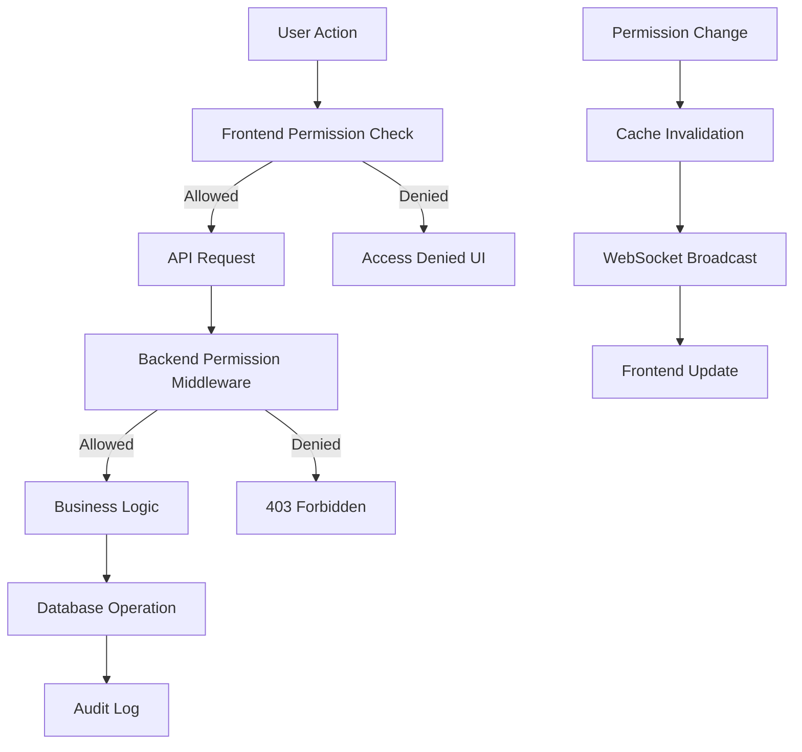

# Permission System Integration Guide

**Complete integration patterns for implementing permission system across frontend, backend, and database layers**

> ๐ **Quick Links**: [Quick Reference](./permission-quick-reference.md) | [Permission Architecture](./permissions-architecture.md) | [Frontend Architecture](./frontend-architecture.md) | [Backend Architecture](./backend-architecture.md)

---

## ๐ฏ Integration Overview

The permission system provides **consistent security patterns** across all application layers while maintaining high performance through caching and real-time updates.

### Integration Flow


---

## ๐ Frontend Permission Patterns

### 1. Component-Level Integration

```typescript
// src/components/common/PermissionGuard.tsx
interface PermissionGuardProps {
  agent: string
  operation: string
  children: React.ReactNode
  fallback?: React.ReactNode
  requireAll?: boolean // For multiple operations
}

export const PermissionGuard: React.FC<PermissionGuardProps> = ({
  agent,
  operation,
  children,
  fallback = null,
  requireAll = false
}) => {
  const { hasAgentPermission, isLoading } = useUserPermissions()
  
  // Handle loading state
  if (isLoading) {
    return <PermissionSkeleton />
  }
  
  // Support multiple operations
  const operations = Array.isArray(operation) ? operation : [operation]
  const hasPermission = requireAll
    ? operations.every(op => hasAgentPermission(agent, op))
    : operations.some(op => hasAgentPermission(agent, op))
  
  if (!hasPermission) {
    return <>{fallback}</>
  }
  
  return <>{children}</>
}

// Usage patterns
export const ClientManagementPage = () => {
  return (
    <div className="space-y-6">
      {/* Basic permission guard */}
      <PermissionGuard agent="client_management" operation="create">
        <CreateClientButton />
      </PermissionGuard>
      
      {/* Multiple operations (any) */}
      <PermissionGuard 
        agent="client_management" 
        operation={["update", "delete"]}
        fallback={<ReadOnlyClientTable />}
      >
        <EditableClientTable />
      </PermissionGuard>
      
      {/* Require all operations */}
      <PermissionGuard 
        agent="client_management" 
        operation={["create", "update", "delete"]}
        requireAll={true}
        fallback={<LimitedClientInterface />}
      >
        <FullClientManagement />
      </PermissionGuard>
    </div>
  )
}
```

### 2. Hook-Based Integration

```typescript
// src/hooks/useUserPermissions.ts
export const useUserPermissions = (userId?: string) => {
  const { user } = useAuth()
  const queryClient = useQueryClient()
  const targetUserId = userId || user?.user_id

  const { data: permissions, isLoading, error } = useQuery({
    queryKey: ['user-permissions', targetUserId],
    queryFn: () => permissionsAPI.getUserPermissions(targetUserId!),
    enabled: !!targetUserId,
    staleTime: 5 * 60 * 1000, // 5 minutes
    retry: 3,
    retryDelay: (attemptIndex) => Math.min(1000 * 2 ** attemptIndex, 30000)
  })

  // Sysadmin bypass with type safety
  const hasAgentPermission = useCallback((agent: string, operation: string): boolean => {
    if (!user) return false
    
    // Sysadmin always has access
    if (user.role === 'sysadmin') return true
    
    // Admin has access to specific agents
    if (user.role === 'admin') {
      const adminAgents = ['client_management', 'reports_analysis']
      return adminAgents.includes(agent)
    }
    
    // Check explicit permissions for regular users
    return permissions?.[agent]?.[operation] || false
  }, [user, permissions])

  // Batch permission checks for performance
  const checkMultiplePermissions = useCallback((checks: Array<{agent: string, operation: string}>) => {
    return checks.map(check => ({
      ...check,
      hasPermission: hasAgentPermission(check.agent, check.operation)
    }))
  }, [hasAgentPermission])

  // Get all permissions for an agent
  const getAgentPermissions = useCallback((agent: string) => {
    if (!user) return null
    
    if (user.role === 'sysadmin') {
      return { create: true, read: true, update: true, delete: true }
    }
    
    if (user.role === 'admin' && ['client_management', 'reports_analysis'].includes(agent)) {
      return { create: true, read: true, update: true, delete: true }
    }
    
    return permissions?.[agent] || null
  }, [user, permissions])

  return {
    permissions,
    isLoading,
    error,
    hasAgentPermission,
    checkMultiplePermissions,
    getAgentPermissions,
    // Invalidate permissions cache
    invalidatePermissions: () => queryClient.invalidateQueries(['user-permissions', targetUserId])
  }
}

// Advanced permission hooks
export const usePermissionMatrix = () => {
  const { data: users } = useQuery({
    queryKey: ['users'],
    queryFn: usersAPI.getUsers
  })

  const { data: permissionMatrix, isLoading } = useQuery({
    queryKey: ['permission-matrix'],
    queryFn: permissionsAPI.getPermissionMatrix,
    staleTime: 2 * 60 * 1000 // 2 minutes for admin interface
  })

  const updatePermission = useMutation({
    mutationFn: ({ userId, agent, operation, value }: {
      userId: string
      agent: string
      operation: string
      value: boolean
    }) => permissionsAPI.updateSinglePermission(userId, agent, operation, value),
    onSuccess: () => {
      queryClient.invalidateQueries(['permission-matrix'])
      queryClient.invalidateQueries(['user-permissions'])
    },
    onError: (error) => {
      toast.error(`Failed to update permission: ${error.message}`)
    }
  })

  return {
    users,
    permissionMatrix,
    isLoading,
    updatePermission: updatePermission.mutate,
    isUpdating: updatePermission.isLoading
  }
}
```

### 3. Route-Level Integration

```typescript
// src/components/common/ProtectedRoute.tsx
interface ProtectedRouteProps {
  agent: string
  operation: string
  children: React.ReactNode
  redirectTo?: string
  showAccessDenied?: boolean
}

export const ProtectedRoute: React.FC<ProtectedRouteProps> = ({
  agent,
  operation,
  children,
  redirectTo = '/dashboard',
  showAccessDenied = true
}) => {
  const { hasAgentPermission, isLoading } = useUserPermissions()
  const router = useRouter()

  useEffect(() => {
    if (!isLoading && !hasAgentPermission(agent, operation)) {
      if (redirectTo) {
        router.push(redirectTo)
      }
    }
  }, [isLoading, hasAgentPermission, agent, operation, redirectTo, router])

  if (isLoading) {
    return <PageSkeleton />
  }

  if (!hasAgentPermission(agent, operation)) {
    return showAccessDenied ? <AccessDeniedPage /> : null
  }

  return <>{children}</>
}

// Page-level usage
export default function ClientsPage() {
  return (
    <ProtectedRoute agent="client_management" operation="read">
      <ClientManagementInterface />
    </ProtectedRoute>
  )
}

// Layout-level usage with multiple checks
export const DashboardLayout = ({ children }: { children: React.ReactNode }) => {
  const { hasAgentPermission } = useUserPermissions()
  
  const navigationItems = useMemo(() => {
    const items = []
    
    if (hasAgentPermission('client_management', 'read')) {
      items.push({ href: '/clients', label: 'Clients', icon: Users })
    }
    
    if (hasAgentPermission('pdf_processing', 'read')) {
      items.push({ href: '/documents', label: 'Documents', icon: FileText })
    }
    
    if (hasAgentPermission('reports_analysis', 'read')) {
      items.push({ href: '/reports', label: 'Reports', icon: BarChart })
    }
    
    if (hasAgentPermission('audio_recording', 'read')) {
      items.push({ href: '/recordings', label: 'Recordings', icon: Mic })
    }
    
    return items
  }, [hasAgentPermission])

  return (
    <div className="flex h-screen bg-background">
      <Sidebar navigationItems={navigationItems} />
      <main className="flex-1 overflow-auto">
        {children}
      </main>
    </div>
  )
}
```

### 4. Real-time Updates Integration

```typescript
// src/hooks/usePermissionUpdates.ts
export const usePermissionUpdates = () => {
  const { user } = useAuth()
  const queryClient = useQueryClient()
  const permissionStore = usePermissionStore()
  const toast = useToast()

  useEffect(() => {
    if (!user?.user_id) return

    const wsUrl = `${process.env.NEXT_PUBLIC_WS_URL}/ws/permissions`
    const ws = new WebSocket(wsUrl)
    
    ws.onopen = () => {
      console.log('Permission WebSocket connected')
      permissionStore.setWebsocketStatus(true)
    }
    
    ws.onmessage = (event) => {
      try {
        const data = JSON.parse(event.data)
        
        switch (data.type) {
          case 'permission_update':
            handlePermissionUpdate(data)
            break
          case 'bulk_permission_update':
            handleBulkPermissionUpdate(data)
            break
          case 'permission_template_applied':
            handleTemplateApplication(data)
            break
        }
      } catch (error) {
        console.error('Failed to parse WebSocket message:', error)
      }
    }
    
    ws.onclose = () => {
      console.log('Permission WebSocket disconnected')
      permissionStore.setWebsocketStatus(false)
    }
    
    ws.onerror = (error) => {
      console.error('Permission WebSocket error:', error)
      permissionStore.setWebsocketStatus(false)
    }

    const handlePermissionUpdate = (data: any) => {
      // Invalidate permission queries for updated user
      queryClient.invalidateQueries(['user-permissions', data.user_id])
      
      // Update local store if it's the current user
      if (data.user_id === user.user_id) {
        permissionStore.setPermissions(data.permissions)
        toast.info('Suas permissรตes foram atualizadas')
        
        // Optionally redirect if current page requires permissions
        const currentPath = window.location.pathname
        if (currentPath.includes('/admin') && !data.permissions.admin_access) {
          window.location.href = '/dashboard'
        }
      }
      
      // Invalidate admin permission matrix
      queryClient.invalidateQueries(['permission-matrix'])
    }

    const handleBulkPermissionUpdate = (data: any) => {
      // Invalidate all permission-related queries
      queryClient.invalidateQueries(['user-permissions'])
      queryClient.invalidateQueries(['permission-matrix'])
      
      if (data.user_ids.includes(user.user_id)) {
        toast.info('Suas permissรตes foram atualizadas')
      }
    }

    const handleTemplateApplication = (data: any) => {
      queryClient.invalidateQueries(['user-permissions', data.user_id])
      
      if (data.user_id === user.user_id) {
        toast.info(`Template "${data.template_name}" foi aplicado ร s suas permissรตes`)
      }
    }

    return () => {
      ws.close()
    }
  }, [user?.user_id, queryClient, permissionStore, toast])
}
```

---

## ๐  Backend Permission Patterns

### 1. Middleware Integration

```python
# src/core/middleware.py
from functools import wraps
from typing import List, Optional
from fastapi import HTTPException, Depends
from src.core.security import get_current_user
from src.services.permission_service import get_permission_service

def require_agent_permission(agent_name: str, operation: str, bypass_sysadmin: bool = True):
    """
    Decorator for API endpoint permission validation
    
    Args:
        agent_name: Name of the agent (client_management, pdf_processing, etc.)
        operation: Required operation (create, read, update, delete)
        bypass_sysadmin: Whether sysadmins bypass permission checks (default: True)
    """
    def decorator(func):
        @wraps(func)
        async def wrapper(*args, current_user = Depends(get_current_user), **kwargs):
            # Sysadmin bypass (optional)
            if bypass_sysadmin and current_user.role == "sysadmin":
                return await func(*args, current_user=current_user, **kwargs)
            
            # Admin role inheritance for specific agents
            if current_user.role == "admin":
                admin_agents = ["client_management", "reports_analysis"]
                if agent_name in admin_agents:
                    return await func(*args, current_user=current_user, **kwargs)
            
            # Check specific permission
            permission_service = get_permission_service()
            has_permission = await permission_service.has_agent_permission(
                current_user.user_id, agent_name, operation
            )
            
            if not has_permission:
                raise HTTPException(
                    status_code=403,
                    detail={
                        "error": "Insufficient permissions",
                        "required_permission": f"{agent_name}:{operation}",
                        "user_role": current_user.role,
                        "user_id": str(current_user.user_id)
                    }
                )
            
            return await func(*args, current_user=current_user, **kwargs)
        return wrapper
    return decorator

def require_multiple_permissions(
    permissions: List[tuple[str, str]], 
    require_all: bool = True
):
    """
    Decorator for endpoints requiring multiple permissions
    
    Args:
        permissions: List of (agent_name, operation) tuples
        require_all: Whether all permissions are required (AND) or any (OR)
    """
    def decorator(func):
        @wraps(func)
        async def wrapper(*args, current_user = Depends(get_current_user), **kwargs):
            if current_user.role == "sysadmin":
                return await func(*args, current_user=current_user, **kwargs)
            
            permission_service = get_permission_service()
            permission_checks = []
            
            for agent_name, operation in permissions:
                has_permission = await permission_service.has_agent_permission(
                    current_user.user_id, agent_name, operation
                )
                permission_checks.append(has_permission)
            
            # Check if requirements are met
            has_access = all(permission_checks) if require_all else any(permission_checks)
            
            if not has_access:
                missing_permissions = [
                    f"{agent}:{op}" for (agent, op), has_perm in zip(permissions, permission_checks)
                    if not has_perm
                ]
                
                raise HTTPException(
                    status_code=403,
                    detail={
                        "error": "Insufficient permissions",
                        "required_permissions": [f"{agent}:{op}" for agent, op in permissions],
                        "missing_permissions": missing_permissions,
                        "require_all": require_all
                    }
                )
            
            return await func(*args, current_user=current_user, **kwargs)
        return wrapper
    return decorator

# Usage examples
@router.post("/clients", response_model=ClientResponse)
@require_agent_permission("client_management", "create")
async def create_client(
    client_data: ClientCreate,
    current_user: User = Depends(get_current_user)
):
    return await client_service.create_client(client_data, current_user.user_id)

@router.put("/clients/{client_id}/archive")
@require_multiple_permissions([
    ("client_management", "update"),
    ("client_management", "delete")
], require_all=True)
async def archive_client(
    client_id: UUID,
    current_user: User = Depends(get_current_user)
):
    return await client_service.archive_client(client_id, current_user.user_id)
```

### 2. Service Layer Integration

```python
# src/services/base_service.py
class BaseService:
    """Base service with permission checking capabilities"""
    
    def __init__(self, db: AsyncSession, permission_service: PermissionService):
        self.db = db
        self.permission_service = permission_service
    
    async def check_permission_or_raise(
        self, 
        user_id: UUID, 
        agent_name: str, 
        operation: str,
        context: Optional[Dict] = None
    ):
        """Check permission and raise exception if denied"""
        has_permission = await self.permission_service.has_agent_permission(
            user_id, agent_name, operation
        )
        
        if not has_permission:
            raise PermissionDeniedError(
                f"User {user_id} lacks {agent_name}:{operation} permission",
                context=context
            )
    
    async def check_multiple_permissions_or_raise(
        self,
        user_id: UUID,
        permissions: List[tuple[str, str]],
        require_all: bool = True
    ):
        """Check multiple permissions and raise if requirements not met"""
        results = []
        for agent_name, operation in permissions:
            has_perm = await self.permission_service.has_agent_permission(
                user_id, agent_name, operation
            )
            results.append(has_perm)
        
        has_access = all(results) if require_all else any(results)
        
        if not has_access:
            missing = [f"{agent}:{op}" for (agent, op), has_perm in zip(permissions, results) if not has_perm]
            raise PermissionDeniedError(
                f"Missing permissions: {missing}",
                context={"required_permissions": permissions, "require_all": require_all}
            )

# src/services/client_service.py
class ClientService(BaseService):
    async def create_client(self, client_data: ClientCreate, user_id: UUID) -> Client:
        # Permission check in service layer
        await self.check_permission_or_raise(user_id, "client_management", "create")
        
        # Business logic
        client = Client(**client_data.dict(), created_by=user_id)
        self.db.add(client)
        await self.db.commit()
        await self.db.refresh(client)
        
        # Audit logging
        await self.audit_service.log_client_creation(client, user_id)
        
        return client
    
    async def update_client(self, client_id: UUID, updates: ClientUpdate, user_id: UUID) -> Client:
        # Permission check
        await self.check_permission_or_raise(user_id, "client_management", "update")
        
        # Get existing client
        client = await self.get_client_or_404(client_id)
        
        # Apply updates
        for field, value in updates.dict(exclude_unset=True).items():
            setattr(client, field, value)
        
        client.updated_by = user_id
        client.updated_at = datetime.utcnow()
        
        await self.db.commit()
        await self.db.refresh(client)
        
        # Audit logging
        await self.audit_service.log_client_update(client, updates, user_id)
        
        return client
    
    async def delete_client(self, client_id: UUID, user_id: UUID) -> bool:
        # Permission check
        await self.check_permission_or_raise(user_id, "client_management", "delete")
        
        # Check for dependencies
        dependencies = await self.check_client_dependencies(client_id)
        if dependencies:
            raise BusinessLogicError(
                f"Cannot delete client with dependencies: {dependencies}"
            )
        
        # Soft delete
        client = await self.get_client_or_404(client_id)
        client.is_active = False
        client.deleted_at = datetime.utcnow()
        client.deleted_by = user_id
        
        await self.db.commit()
        
        # Audit logging
        await self.audit_service.log_client_deletion(client, user_id)
        
        return True
    
    async def get_filtered_clients(self, user_id: UUID, filters: ClientFilters) -> List[Client]:
        # Permission check
        await self.check_permission_or_raise(user_id, "client_management", "read")
        
        # Build query with user context
        query = select(Client).where(Client.is_active == True)
        
        # Apply filters
        if filters.name:
            query = query.where(Client.full_name.ilike(f"%{filters.name}%"))
        
        if filters.status:
            query = query.where(Client.status == filters.status)
        
        # Execute query
        result = await self.db.execute(query)
        return result.scalars().all()
```

### 3. WebSocket Integration

```python
# src/core/websockets.py
class PermissionWebSocketManager:
    """WebSocket manager for real-time permission updates"""
    
    def __init__(self):
        self.active_connections: Dict[str, WebSocket] = {}
        self.user_connections: Dict[UUID, List[str]] = {}
    
    async def connect(self, websocket: WebSocket, user_id: UUID, connection_id: str):
        """Accept WebSocket connection and register user"""
        await websocket.accept()
        
        self.active_connections[connection_id] = websocket
        
        if user_id not in self.user_connections:
            self.user_connections[user_id] = []
        self.user_connections[user_id].append(connection_id)
    
    def disconnect(self, connection_id: str, user_id: UUID):
        """Remove WebSocket connection"""
        if connection_id in self.active_connections:
            del self.active_connections[connection_id]
        
        if user_id in self.user_connections:
            self.user_connections[user_id] = [
                conn_id for conn_id in self.user_connections[user_id] 
                if conn_id != connection_id
            ]
            if not self.user_connections[user_id]:
                del self.user_connections[user_id]
    
    async def broadcast_permission_update(
        self, 
        target_user_id: UUID, 
        permissions: Dict,
        updated_by_user_id: UUID
    ):
        """Broadcast permission updates to relevant users"""
        message = {
            "type": "permission_update",
            "user_id": str(target_user_id),
            "permissions": permissions,
            "updated_by": str(updated_by_user_id),
            "timestamp": datetime.utcnow().isoformat()
        }
        
        # Send to target user
        await self._send_to_user(target_user_id, message)
        
        # Send to admin users
        admin_users = await self.get_admin_users()
        for admin_user in admin_users:
            if admin_user.user_id != target_user_id:
                await self._send_to_user(admin_user.user_id, message)
    
    async def broadcast_bulk_update(
        self,
        user_ids: List[UUID],
        permissions: Dict,
        updated_by_user_id: UUID
    ):
        """Broadcast bulk permission updates"""
        message = {
            "type": "bulk_permission_update",
            "user_ids": [str(uid) for uid in user_ids],
            "permissions": permissions,
            "updated_by": str(updated_by_user_id),
            "timestamp": datetime.utcnow().isoformat()
        }
        
        # Send to all affected users
        for user_id in user_ids:
            await self._send_to_user(user_id, message)
        
        # Send to admin users
        admin_users = await self.get_admin_users()
        for admin_user in admin_users:
            await self._send_to_user(admin_user.user_id, message)
    
    async def _send_to_user(self, user_id: UUID, message: Dict):
        """Send message to all connections for a user"""
        if user_id not in self.user_connections:
            return
        
        dead_connections = []
        
        for connection_id in self.user_connections[user_id]:
            if connection_id in self.active_connections:
                try:
                    await self.active_connections[connection_id].send_json(message)
                except ConnectionClosedOK:
                    dead_connections.append(connection_id)
                except Exception as e:
                    logger.error(f"Failed to send WebSocket message: {e}")
                    dead_connections.append(connection_id)
        
        # Clean up dead connections
        for connection_id in dead_connections:
            self.disconnect(connection_id, user_id)

# WebSocket endpoint
permission_ws_manager = PermissionWebSocketManager()

@app.websocket("/ws/permissions")
async def permission_websocket_endpoint(
    websocket: WebSocket,
    current_user: User = Depends(get_current_user_ws)
):
    connection_id = str(uuid.uuid4())
    
    await permission_ws_manager.connect(websocket, current_user.user_id, connection_id)
    
    try:
        while True:
            # Keep connection alive
            await websocket.receive_text()
    except WebSocketDisconnect:
        permission_ws_manager.disconnect(connection_id, current_user.user_id)
```

---

## ๐ฏ Database Integration Patterns

### 1. Permission Validation in Database Layer

```python
# src/models/permissions.py
class UserAgentPermission(SQLModel, table=True):
    __tablename__ = "user_agent_permissions"
    
    permission_id: UUID = Field(primary_key=True, default_factory=uuid.uuid4)
    user_id: UUID = Field(foreign_key="users.user_id", index=True)
    agent_name: str = Field(index=True)
    permissions: Dict = Field(sa_column=Column(JSON))
    created_by_user_id: UUID = Field(foreign_key="users.user_id")
    created_at: datetime = Field(default_factory=datetime.utcnow)
    updated_at: datetime = Field(default_factory=datetime.utcnow)
    
    # Constraints
    __table_args__ = (
        UniqueConstraint('user_id', 'agent_name', name='unique_user_agent'),
        CheckConstraint(
            "agent_name IN ('client_management', 'pdf_processing', 'reports_analysis', 'audio_recording')",
            name='valid_agent_name'
        ),
    )

# Database queries with permission context
class PermissionRepository:
    def __init__(self, db: AsyncSession):
        self.db = db
    
    async def get_user_permissions(self, user_id: UUID) -> Dict[str, Dict]:
        """Get all permissions for a user"""
        query = select(UserAgentPermission).where(
            UserAgentPermission.user_id == user_id
        )
        result = await self.db.execute(query)
        
        permissions = {}
        for perm in result.scalars().all():
            permissions[perm.agent_name] = perm.permissions
            
        return permissions
    
    async def get_agent_permissions(self, user_id: UUID, agent_name: str) -> Optional[Dict]:
        """Get permissions for specific agent"""
        query = select(UserAgentPermission).where(
            UserAgentPermission.user_id == user_id,
            UserAgentPermission.agent_name == agent_name
        )
        result = await self.db.execute(query)
        perm = result.scalar_one_or_none()
        
        return perm.permissions if perm else None
    
    async def set_agent_permissions(
        self, 
        user_id: UUID, 
        agent_name: str, 
        permissions: Dict,
        assigned_by_user_id: UUID
    ):
        """Set permissions for user-agent combination"""
        # Upsert operation
        query = select(UserAgentPermission).where(
            UserAgentPermission.user_id == user_id,
            UserAgentPermission.agent_name == agent_name
        )
        result = await self.db.execute(query)
        existing = result.scalar_one_or_none()
        
        if existing:
            # Update existing
            old_permissions = existing.permissions
            existing.permissions = permissions
            existing.updated_at = datetime.utcnow()
        else:
            # Create new
            old_permissions = None
            new_perm = UserAgentPermission(
                user_id=user_id,
                agent_name=agent_name,
                permissions=permissions,
                created_by_user_id=assigned_by_user_id
            )
            self.db.add(new_perm)
        
        await self.db.commit()
        
        # Log the change
        await self.log_permission_change(
            user_id, agent_name, 'UPDATE', old_permissions, permissions, assigned_by_user_id
        )
    
    async def bulk_set_permissions(
        self,
        user_ids: List[UUID],
        permissions: Dict[str, Dict],
        assigned_by_user_id: UUID
    ):
        """Bulk set permissions for multiple users"""
        for user_id in user_ids:
            for agent_name, agent_permissions in permissions.items():
                await self.set_agent_permissions(
                    user_id, agent_name, agent_permissions, assigned_by_user_id
                )
```

### 2. Audit Integration

```python
# src/models/audit.py
class PermissionAuditLog(SQLModel, table=True):
    __tablename__ = "permission_audit_log"
    
    audit_id: UUID = Field(primary_key=True, default_factory=uuid.uuid4)
    user_id: UUID = Field(foreign_key="users.user_id", index=True)
    agent_name: str = Field(index=True)
    action: str = Field(index=True)  # GRANT, REVOKE, UPDATE, BULK_GRANT, etc.
    old_permissions: Optional[Dict] = Field(sa_column=Column(JSON))
    new_permissions: Optional[Dict] = Field(sa_column=Column(JSON))
    changed_by_user_id: UUID = Field(foreign_key="users.user_id")
    change_reason: Optional[str] = None
    ip_address: Optional[str] = None
    user_agent: Optional[str] = None
    timestamp: datetime = Field(default_factory=datetime.utcnow, index=True)

# Audit service integration
class PermissionAuditService:
    def __init__(self, db: AsyncSession):
        self.db = db
    
    async def log_permission_change(
        self,
        user_id: UUID,
        agent_name: str,
        action: str,
        old_permissions: Optional[Dict],
        new_permissions: Optional[Dict],
        changed_by_user_id: UUID,
        change_reason: Optional[str] = None,
        request_context: Optional[Dict] = None
    ):
        """Log permission change for audit trail"""
        audit_entry = PermissionAuditLog(
            user_id=user_id,
            agent_name=agent_name,
            action=action,
            old_permissions=old_permissions,
            new_permissions=new_permissions,
            changed_by_user_id=changed_by_user_id,
            change_reason=change_reason,
            ip_address=request_context.get('ip_address') if request_context else None,
            user_agent=request_context.get('user_agent') if request_context else None
        )
        
        self.db.add(audit_entry)
        await self.db.commit()
    
    async def get_user_permission_history(
        self, 
        user_id: UUID, 
        limit: int = 50
    ) -> List[PermissionAuditLog]:
        """Get permission change history for a user"""
        query = select(PermissionAuditLog).where(
            PermissionAuditLog.user_id == user_id
        ).order_by(PermissionAuditLog.timestamp.desc()).limit(limit)
        
        result = await self.db.execute(query)
        return result.scalars().all()
    
    async def get_permission_changes_report(
        self,
        start_date: datetime,
        end_date: datetime
    ) -> List[Dict]:
        """Generate permission changes report"""
        query = select(
            PermissionAuditLog.agent_name,
            PermissionAuditLog.action,
            func.count().label('change_count')
        ).where(
            PermissionAuditLog.timestamp >= start_date,
            PermissionAuditLog.timestamp <= end_date
        ).group_by(
            PermissionAuditLog.agent_name,
            PermissionAuditLog.action
        )
        
        result = await self.db.execute(query)
        return [
            {
                'agent_name': row.agent_name,
                'action': row.action,
                'change_count': row.change_count
            }
            for row in result
        ]
```

---

## ๐ Performance Integration Patterns

### 1. Caching Integration

```python
# src/services/permission_service.py
import redis.asyncio as redis
import json
from typing import Optional

class PermissionService:
    def __init__(self, db: AsyncSession, redis_client: redis.Redis):
        self.db = db
        self.redis = redis_client
        self.cache_ttl = 300  # 5 minutes
        self.cache_prefix = "permissions"
    
    async def has_agent_permission(
        self, 
        user_id: UUID, 
        agent_name: str, 
        operation: str
    ) -> bool:
        """Check permission with Redis caching"""
        # Check cache first
        cache_key = f"{self.cache_prefix}:{user_id}:{agent_name}"
        cached_permissions = await self.redis.get(cache_key)
        
        if cached_permissions:
            try:
                permissions = json.loads(cached_permissions)
                return permissions.get(operation, False)
            except json.JSONDecodeError:
                # Invalid cache entry, remove it
                await self.redis.delete(cache_key)
        
        # Load from database
        permissions = await self.repository.get_agent_permissions(user_id, agent_name)
        
        if permissions is None:
            permissions = {}
        
        # Cache the result
        await self.redis.setex(
            cache_key, 
            self.cache_ttl, 
            json.dumps(permissions)
        )
        
        return permissions.get(operation, False)
    
    async def invalidate_user_permissions(self, user_id: UUID):
        """Invalidate all cached permissions for a user"""
        pattern = f"{self.cache_prefix}:{user_id}:*"
        keys = await self.redis.keys(pattern)
        
        if keys:
            await self.redis.delete(*keys)
    
    async def warm_permission_cache(self, user_ids: List[UUID]):
        """Pre-warm permission cache for multiple users"""
        agents = ['client_management', 'pdf_processing', 'reports_analysis', 'audio_recording']
        
        for user_id in user_ids:
            user_permissions = await self.repository.get_user_permissions(user_id)
            
            for agent_name in agents:
                cache_key = f"{self.cache_prefix}:{user_id}:{agent_name}"
                permissions = user_permissions.get(agent_name, {})
                
                await self.redis.setex(
                    cache_key,
                    self.cache_ttl,
                    json.dumps(permissions)
                )
```

### 2. Batch Processing Integration

```python
# Batch permission validation for performance
class BatchPermissionService:
    def __init__(self, permission_service: PermissionService):
        self.permission_service = permission_service
    
    async def check_bulk_permissions(
        self,
        user_id: UUID,
        permission_checks: List[tuple[str, str]]  # (agent, operation) tuples
    ) -> Dict[str, bool]:
        """Check multiple permissions efficiently"""
        results = {}
        
        # Group by agent to minimize cache lookups
        agent_groups = {}
        for agent, operation in permission_checks:
            if agent not in agent_groups:
                agent_groups[agent] = []
            agent_groups[agent].append(operation)
        
        # Check permissions by agent
        for agent_name, operations in agent_groups.items():
            agent_permissions = await self.permission_service.get_agent_permissions(
                user_id, agent_name
            )
            
            for operation in operations:
                key = f"{agent_name}:{operation}"
                results[key] = agent_permissions.get(operation, False) if agent_permissions else False
        
        return results
    
    async def validate_user_access_to_resources(
        self,
        user_id: UUID,
        resources: List[Dict]  # [{"type": "client", "id": "uuid", "operation": "read"}]
    ) -> Dict[str, bool]:
        """Validate user access to multiple resources"""
        # Map resource types to agents
        resource_agent_map = {
            "client": "client_management",
            "document": "pdf_processing", 
            "report": "reports_analysis",
            "recording": "audio_recording"
        }
        
        # Convert to permission checks
        permission_checks = []
        for resource in resources:
            agent = resource_agent_map.get(resource["type"])
            if agent:
                permission_checks.append((agent, resource["operation"]))
        
        # Batch check permissions
        permission_results = await self.check_bulk_permissions(user_id, permission_checks)
        
        # Map back to resource IDs
        access_results = {}
        for resource in resources:
            agent = resource_agent_map.get(resource["type"])
            if agent:
                key = f"{agent}:{resource['operation']}"
                access_results[resource["id"]] = permission_results.get(key, False)
            else:
                access_results[resource["id"]] = False
        
        return access_results
```

---

## ๐งช Testing Integration Patterns

### 1. Frontend Testing Integration

```typescript
// src/__tests__/utils/permission-test-utils.ts
export const createMockPermissionHooks = (permissions: Record<string, Record<string, boolean>> = {}) => {
  return {
    useUserPermissions: jest.fn(() => ({
      permissions,
      isLoading: false,
      error: null,
      hasAgentPermission: jest.fn((agent: string, operation: string) => 
        permissions[agent]?.[operation] || false
      ),
      getAgentPermissions: jest.fn((agent: string) => permissions[agent] || null),
      checkMultiplePermissions: jest.fn((checks) => 
        checks.map(check => ({
          ...check,
          hasPermission: permissions[check.agent]?.[check.operation] || false
        }))
      )
    })),
    usePermissionUpdates: jest.fn(),
    usePermissionMatrix: jest.fn(() => ({
      users: [],
      permissionMatrix: {},
      isLoading: false,
      updatePermission: jest.fn(),
      isUpdating: false
    }))
  }
}

// Test example
describe('ClientManagementPage', () => {
  beforeEach(() => {
    jest.clearAllMocks()
  })

  it('should show create button when user has create permission', () => {
    const mockHooks = createMockPermissionHooks({
      client_management: {
        create: true,
        read: true,
        update: false,
        delete: false
      }
    })
    
    jest.doMock('@/hooks/useUserPermissions', () => mockHooks)
    
    render(<ClientManagementPage />)
    
    expect(screen.getByText('New Client')).toBeInTheDocument()
    expect(screen.queryByText('Edit Client')).not.toBeInTheDocument()
  })
  
  it('should handle permission updates in real-time', async () => {
    const mockHooks = createMockPermissionHooks({
      client_management: { create: false, read: true, update: false, delete: false }
    })
    
    const { rerender } = render(<ClientManagementPage />)
    
    expect(screen.queryByText('New Client')).not.toBeInTheDocument()
    
    // Simulate permission update
    mockHooks.useUserPermissions.mockReturnValue({
      ...mockHooks.useUserPermissions(),
      permissions: {
        client_management: { create: true, read: true, update: false, delete: false }
      },
      hasAgentPermission: jest.fn(() => true)
    })
    
    rerender(<ClientManagementPage />)
    
    expect(screen.getByText('New Client')).toBeInTheDocument()
  })
})
```

### 2. Backend Testing Integration

```python
# src/tests/utils/permission_test_utils.py
import pytest
from unittest.mock import AsyncMock, MagicMock
from src.services.permission_service import PermissionService

class MockPermissionService:
    def __init__(self):
        self.permissions = {}
        self.call_log = []
    
    def set_user_permissions(self, user_id: str, permissions: dict):
        """Set permissions for testing"""
        self.permissions[user_id] = permissions
    
    async def has_agent_permission(self, user_id, agent_name, operation):
        """Mock permission check"""
        call = f"{user_id}:{agent_name}:{operation}"
        self.call_log.append(call)
        
        user_perms = self.permissions.get(str(user_id), {})
        agent_perms = user_perms.get(agent_name, {})
        return agent_perms.get(operation, False)
    
    async def get_agent_permissions(self, user_id, agent_name):
        """Mock get agent permissions"""
        user_perms = self.permissions.get(str(user_id), {})
        return user_perms.get(agent_name, {})
    
    def reset(self):
        """Reset mock state"""
        self.permissions = {}
        self.call_log = []

@pytest.fixture
def mock_permission_service():
    """Provide mock permission service for tests"""
    return MockPermissionService()

# Test example
@pytest.mark.asyncio
async def test_create_client_requires_permission(
    client_service, 
    mock_permission_service,
    regular_user,
    admin_user
):
    # Test: Regular user without permission
    mock_permission_service.set_user_permissions(str(regular_user.user_id), {})
    
    with pytest.raises(PermissionDeniedError):
        await client_service.create_client(
            ClientCreate(full_name="John Doe", cpf="123.456.789-01"),
            regular_user.user_id
        )
    
    # Test: Regular user with permission
    mock_permission_service.set_user_permissions(str(regular_user.user_id), {
        "client_management": {"create": True, "read": True}
    })
    
    client = await client_service.create_client(
        ClientCreate(full_name="Jane Doe", cpf="987.654.321-02"),
        regular_user.user_id
    )
    
    assert client.full_name == "Jane Doe"
    assert str(regular_user.user_id) in mock_permission_service.call_log[0]

@pytest.mark.asyncio  
async def test_api_endpoint_permission_protection(async_client, mock_permission_service):
    # Mock user without permission
    mock_permission_service.set_user_permissions("user123", {})
    
    response = await async_client.post(
        "/api/v1/clients",
        json={"full_name": "Test Client", "cpf": "123.456.789-01"},
        headers={"Authorization": "Bearer mock_token_user123"}
    )
    
    assert response.status_code == 403
    assert "Insufficient permissions" in response.json()["detail"]["error"]
    
    # Grant permission and retry
    mock_permission_service.set_user_permissions("user123", {
        "client_management": {"create": True}
    })
    
    response = await async_client.post(
        "/api/v1/clients",
        json={"full_name": "Test Client", "cpf": "123.456.789-01"},
        headers={"Authorization": "Bearer mock_token_user123"}
    )
    
    assert response.status_code == 201
```

---

## ๐ Migration Strategies

### 1. Gradual Migration Approach

```python
# Migration script for existing codebase
async def migrate_to_permission_system():
    """Migrate existing role-based system to permission system"""
    
    # Step 1: Create permission tables
    await create_permission_tables()
    
    # Step 2: Migrate existing users
    users = await get_all_users()
    
    for user in users:
        if user.role == "admin":
            # Admins get client_management and reports_analysis
            await assign_default_admin_permissions(user.user_id)
        elif user.role == "user":
            # Regular users get read-only client_management initially
            await assign_default_user_permissions(user.user_id)
        # sysadmin role unchanged (bypass system)
    
    # Step 3: Enable permission checks gradually by agent
    await enable_permission_checks_for_agent("client_management")
    await enable_permission_checks_for_agent("pdf_processing")
    await enable_permission_checks_for_agent("reports_analysis")
    await enable_permission_checks_for_agent("audio_recording")
    
    print("Migration completed successfully")

async def assign_default_admin_permissions(user_id: UUID):
    """Assign default permissions for admin users"""
    admin_permissions = {
        "client_management": {
            "create": True,
            "read": True,
            "update": True,
            "delete": True
        },
        "reports_analysis": {
            "create": True,
            "read": True,
            "update": True,
            "delete": False
        }
    }
    
    for agent_name, permissions in admin_permissions.items():
        await permission_service.assign_agent_permissions(
            user_id, agent_name, permissions, system_user_id
        )

async def assign_default_user_permissions(user_id: UUID):
    """Assign default permissions for regular users"""
    user_permissions = {
        "client_management": {
            "create": False,
            "read": True,
            "update": False,
            "delete": False
        }
    }
    
    for agent_name, permissions in user_permissions.items():
        await permission_service.assign_agent_permissions(
            user_id, agent_name, permissions, system_user_id
        )
```

### 2. Feature Flag Integration

```typescript
// Feature flag integration for gradual rollout
interface FeatureFlags {
  useNewPermissionSystem: boolean
  enablePermissionMatrix: boolean
  enableRealTimeUpdates: boolean
}

export const useFeatureFlags = (): FeatureFlags => {
  return {
    useNewPermissionSystem: process.env.NEXT_PUBLIC_ENABLE_PERMISSIONS === 'true',
    enablePermissionMatrix: process.env.NEXT_PUBLIC_ENABLE_PERMISSION_MATRIX === 'true',
    enableRealTimeUpdates: process.env.NEXT_PUBLIC_ENABLE_REALTIME_PERMISSIONS === 'true'
  }
}

// Conditional permission checking
export const useConditionalPermissions = () => {
  const { useNewPermissionSystem } = useFeatureFlags()
  const { user } = useAuth()
  const { hasAgentPermission } = useUserPermissions()

  const checkPermission = useCallback((agent: string, operation: string): boolean => {
    if (!useNewPermissionSystem) {
      // Fallback to role-based system
      if (user?.role === 'sysadmin') return true
      if (user?.role === 'admin') return ['client_management', 'reports_analysis'].includes(agent)
      return agent === 'client_management' && operation === 'read'
    }
    
    // Use new permission system
    return hasAgentPermission(agent, operation)
  }, [useNewPermissionSystem, user, hasAgentPermission])

  return { checkPermission }
}
```

---

*This integration guide provides comprehensive patterns for implementing the permission system across all application layers. For specific implementation details, refer to the [Permission Architecture](./permissions-architecture.md) and [Quick Reference](./permission-quick-reference.md) documents.*