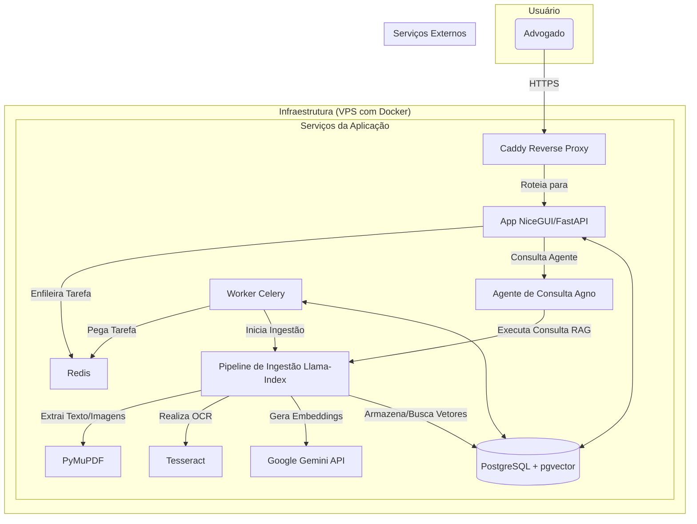

# Seção 2: Arquitetura de Alto Nível

Esta seção estabelece os fundamentos da arquitetura, descrevendo a abordagem geral, a infraestrutura, a organização do código e os principais padrões que guiarão o desenvolvimento.

## Resumo Técnico

A arquitetura do sistema será modular e orientada a serviços, implementada inteiramente em Python. O frontend será construído com **NiceGUI**. O backend consistirá em uma **API FastAPI**, um sistema de processamento de tarefas assíncronas com **Celery** e **Redis**, e um banco de dados **PostgreSQL** com a extensão **pgvector**. A orquestração do pipeline de RAG (Retrieval-Augmented Generation) será gerenciada pelo **Llama-Index**, que utilizará a **API do Google Gemini** para embeddings e geração de respostas. A camada de agentes autônomos, que consome o pipeline RAG, será construída com o framework **Agno**.

## Estrutura do Repositório

* **Estrutura:** **Monorepo**.
* **Justificativa:** Facilita a manutenção da consistência e o gerenciamento de dependências entre os diferentes serviços e agentes. A biblioteca `python-dependency-injector` será utilizada para reforçar a modularidade e o desacoplamento.

## Diagrama de Arquitetura de Alto Nível

