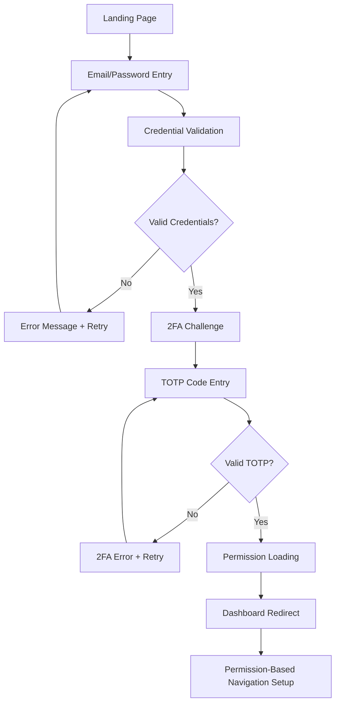
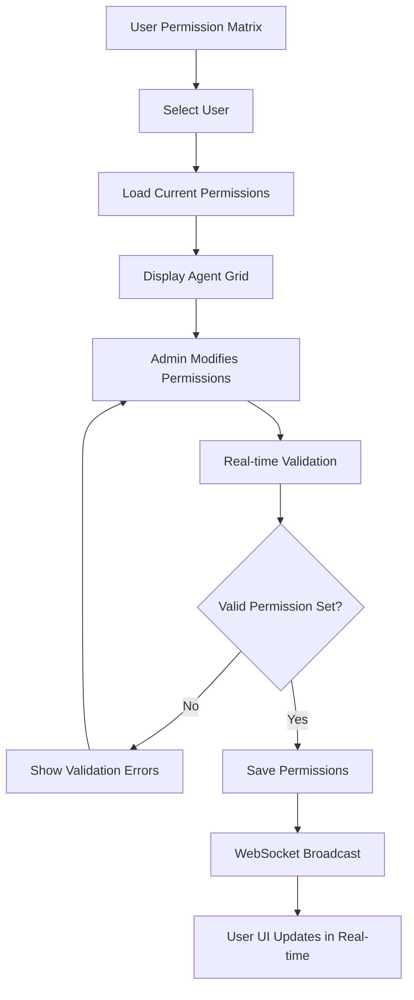
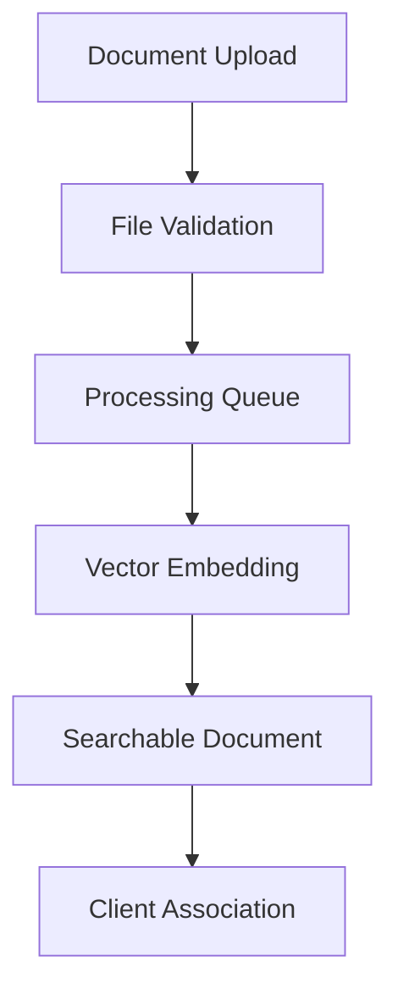
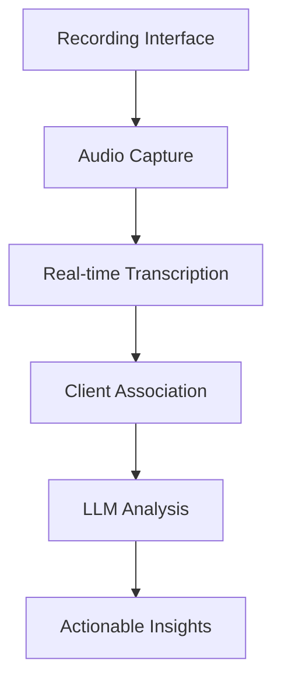
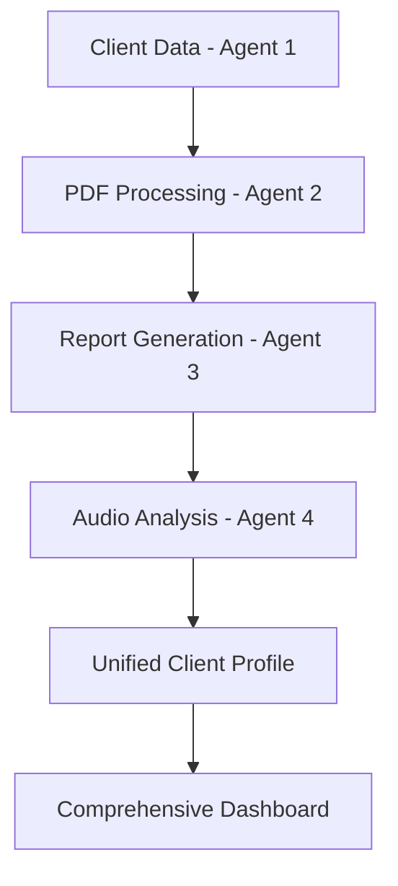
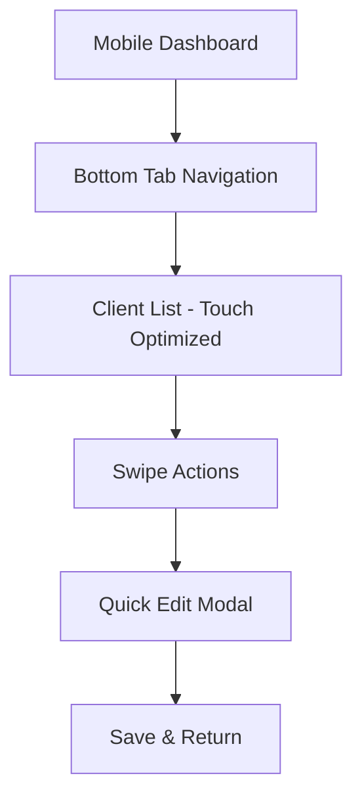
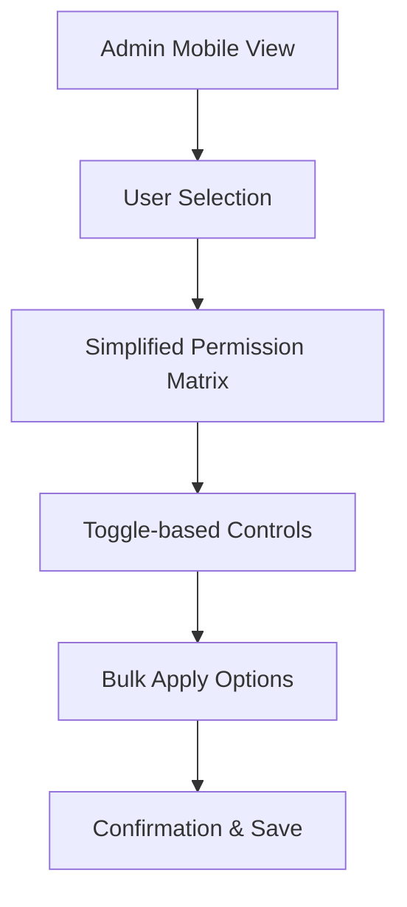
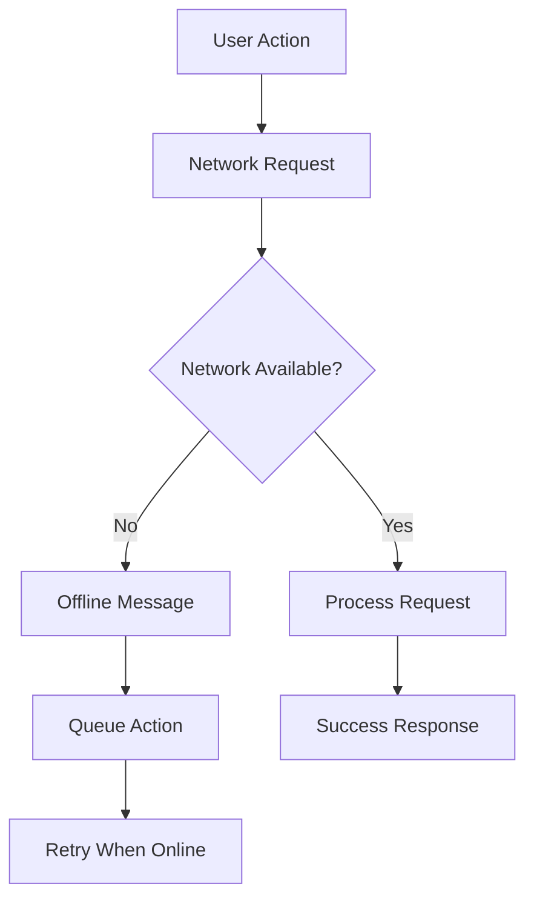
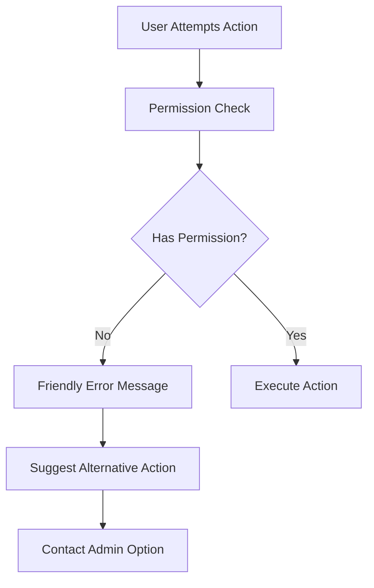

# Multi-Agent IAM Dashboard - UX Specification

*Last Updated: August 4, 2025 - Version 2.0 (Integrated Architecture)*

> **Quick Navigation**: [UX Goals](#ux-goals--principles) | [User Personas](#target-user-personas) | [Information Architecture](#information-architecture) | [User Flows](#user-flows)

---

## Overview

This UX specification defines the user experience and interface design for the Multi-Agent IAM Dashboard **Custom Implementation Service**. It focuses on creating a professional, enterprise-grade platform that reflects each client's unique brand identity while maintaining exceptional usability and accessibility standards.

**Integration with Architecture:**
- **Permission System**: [Permissions Architecture](./permissions-architecture.md)
- **Technical Implementation**: [Frontend Architecture](./frontend-architecture.md)
- **Component Library**: [UI Design System](./ui-design-system.md)
- **Device Adaptation**: [Responsive Design](./responsive-design.md)

---

## Target User Personas

### Primary Persona: Business Administrator (Enhanced)
- **Role**: Operations manager with advanced permission management capabilities
- **Goals**: Configure team access, optimize workflows, manage user permissions across agents
- **Capabilities**: Assign granular agent permissions, create permission templates, monitor team productivity
- **Pain Points**: Complex permission configurations, onboarding delays, access request bottlenecks
- **Tech Comfort**: High - comfortable with advanced administrative interfaces
- **Device Usage**: Desktop-focused for permission management, mobile for monitoring
- **Key Enhancement**: Now manages flexible agent-based permissions instead of rigid roles

### Secondary Persona: System Administrator (Unchanged)  
- **Role**: Technical infrastructure management and system oversight
- **Goals**: Maintain system security, manage infrastructure, monitor service health
- **Capabilities**: Full system control, infrastructure management, security administration
- **Pain Points**: Complex multi-tenant environments, service-level agreement maintenance
- **Tech Comfort**: Very high - expects comprehensive system controls
- **Device Usage**: Desktop with multi-monitor setups, mobile for alerts
- **Permission Model**: Bypass all restrictions (sysadmin role)

### Tertiary Persona: Operational User (Greatly Expanded)
- **Role**: Daily operational tasks within assigned agent areas
- **Goals**: Execute specific business functions efficiently with appropriate access
- **Capabilities**: Agent-specific operations (client management, PDF processing, reports, audio)
- **Permission Examples**: 
  - Client Specialist: Full client management access
  - Data Analyst: Read-only client data + reports analysis
  - Document Processor: PDF processing + client data reading
  - Audio Specialist: Recording management + client access
- **Pain Points**: Limited access blocking productivity, unclear permission boundaries
- **Tech Comfort**: Moderate to high - focused on specific functional areas
- **Device Usage**: Mixed desktop/mobile based on agent requirements
- **Key Enhancement**: 90% of employees now have meaningful system access

---

## UX Goals & Principles

### Primary UX Goals
1. **Professional Enterprise Experience**: Interface conveys trustworthiness and sophistication suitable for client presentation
2. **Brand Flexibility**: Complete visual customization reflecting each client's unique identity
3. **Workflow Efficiency**: Streamlined processes reducing time for common tasks by 50%
4. **Universal Accessibility**: WCAG AA compliance ensuring usability for all users
5. **Responsive Excellence**: Consistent functionality across all device sizes

### Core Design Principles
1. **User-Centric Above All**: Every design decision serves user needs and reduces cognitive load
2. **Simplicity Through Iteration**: Progressive disclosure revealing complexity only when needed  
3. **Delight in Details**: Thoughtful micro-interactions creating memorable, professional experiences
4. **Design for Real Scenarios**: Consider edge cases, error states, and loading conditions
5. **Consistency with Flexibility**: Maintain usability patterns while allowing brand customization

---

## Information Architecture

### Site Map & Screen Inventory

```mermaid
graph TD
    A[Login/2FA] --> B[Main Dashboard]
    
    B --> C[Client Management - Agent 1]
    C --> C1[Client List/Search]
    C --> C2[Client Detail/Edit]
    C --> C3[New Client Registration]
    C --> C4[Bulk Operations]
    C --> C5[CSV Import/Export]
    
    B --> D[PDF Processing - Agent 2]
    D --> D1[Document Upload]
    D --> D2[Processing Queue]
    D --> D3[Document Search]
    D --> D4[Vector Analysis]
    
    B --> E[Reports & Analytics - Agent 3]
    E --> E1[Client Reports]
    E --> E2[System Analytics]
    E --> E3[Export Options]
    E --> E4[Custom Reports]
    
    B --> F[Audio Recording - Agent 4]
    F --> F1[Recording Interface]
    F --> F2[Transcription Management]
    F --> F3[Audio Analysis]
    F --> F4[Recording Library]
    
    B --> G[User Management]
    G --> G1[User List]
    G --> G2[Create User]
    G --> G3[User Profile Management]
    
    B --> H[Permission Management]
    H --> H1[User Permission Matrix]
    H --> H2[Individual User Permissions]
    H --> H3[Permission Templates]
    H --> H4[Bulk Permission Operations]
    H --> H5[Permission Audit Log]
    H --> H6[Template Management]
    
    B --> I[System Administration]
    I --> I1[System Settings]
    I --> I2[Audit Trail]
    I --> I3[System Health]
    I --> I4[Branding Configuration]
    I --> I5[Agent Configuration]
```



### Permission-Aware Navigation Structure

#### Primary Navigation (Left Sidebar) - Permission Controlled
- **Dashboard**: Overview and quick actions *(Always visible)*
- **Clientes** (Client Management): Client management hub *(Requires: client_management.read)*
  - Client list, search, and filtering
  - New client registration *(Requires: client_management.create)*
  - Client editing and updates *(Requires: client_management.update)*
  - Bulk operations *(Requires: client_management.update)*
  - Client deletion *(Requires: client_management.delete)*
- **Documentos** (PDF Processing): Document management *(Requires: pdf_processing.read)*
  - Document upload *(Requires: pdf_processing.create)*
  - Processing management *(Requires: pdf_processing.update)*
  - Document search and retrieval
  - Document deletion *(Requires: pdf_processing.delete)*
- **Relatórios** (Reports & Analytics): Analytics hub *(Requires: reports_analysis.read)*
  - Report generation *(Requires: reports_analysis.create)*
  - Report modification *(Requires: reports_analysis.update)*
  - Export functionality
- **Gravações** (Audio Recording): Audio management *(Requires: audio_recording.read)*
  - Recording interface *(Requires: audio_recording.create)*
  - Transcription management *(Requires: audio_recording.update)*
  - Recording deletion *(Requires: audio_recording.delete)*
- **Usuários** (User Management): User administration *(Admin/Sysadmin only)*
  - User creation and management
  - User profile editing
- **Permissões** (Permission Management): Permission administration *(Admin/Sysadmin only)*
  - User permission matrix
  - Individual permission management  
  - Template management
  - Bulk operations
  - Audit logging
- **Sistema** (System Administration): System configuration *(Admin/Sysadmin only)*
  - System settings
  - Branding configuration
  - Agent configuration
  - System health monitoring

#### Dynamic Navigation Behavior
- Navigation items are **dynamically filtered** based on user permissions
- Unavailable sections are **completely hidden** (not just disabled)
- **Permission inheritance** ensures admins see client_management and reports_analysis
- **Sysadmin bypass** shows all navigation items regardless of explicit permissions
- **Real-time updates** via WebSocket immediately show/hide navigation items when permissions change

**Technical Implementation**: See [Permission Integration Guide](./permission-integration-guide.md#navigation-permission-patterns) for code patterns.

#### Secondary Navigation (Within Sections)
- **Breadcrumb Navigation**: Always visible showing current location with permission context
- **Tab-based Sub-sections**: For complex areas with operation-specific tabs
  - "View" tabs for read permissions
  - "Edit" tabs for update permissions
  - "Manage" tabs for create/delete permissions
- **Action-based Navigation**: Context-sensitive actions based on specific permissions
  - Create buttons only visible with create permissions
  - Edit buttons only visible with update permissions
  - Delete buttons only visible with delete permissions

#### Permission-Aware Action Controls
- **Conditional Action Buttons**: Actions appear only when user has required permissions
- **Graceful Degradation**: Read-only interfaces when update permissions are missing
- **Permission Feedback**: Clear messaging when actions are unavailable due to permissions
- **Optimistic UI**: Actions appear immediately with server-side validation

#### Mobile Navigation - Permission Responsive
- **Collapsible Hamburger Menu**: Space-efficient navigation with permission filtering
- **Bottom Tab Bar**: Quick access to permitted functions only
  - Dashboard (always present)
  - Up to 4 most-used permitted agents
  - "More" overflow for additional permitted sections
- **Swipe Gestures**: Natural navigation between permitted sections
- **Touch-Optimized**: 44px minimum touch targets for all permission-controlled elements

---

## User Flows

### 1. Enhanced Login & Authentication Flow



**Key UX Considerations:**
- **Progressive Disclosure**: Show only essential fields at each step
- **Clear Error States**: Specific, actionable error messages
- **Loading States**: Visual feedback during permission loading
- **Accessibility**: Screen reader announcements for state changes

### 2. Permission-Aware Client Management Flow

```mermaid
graph TD
    A[Client List View] --> B{Has Create Permission?}
    B -->|Yes| C[Show "New Client" Button]
    B -->|No| D[Hide Create Actions]
    C --> E[Client Creation Form]
    D --> F[Read-Only Client List]
    E --> G[Form Validation]
    G --> H[Client Created]
    F --> I[Client Detail View]
    I --> J{Has Update Permission?}
    J -->|Yes| K[Show Edit Actions]
    J -->|No| L[Read-Only Detail View]
```

**Permission Integration:**
- **Dynamic UI**: Buttons and forms appear based on permissions
- **Graceful Degradation**: Full functionality when permitted, read-only when not
- **Clear Feedback**: Users understand their access level immediately

### 3. Multi-Agent Permission Management Flow



**Advanced UX Features:**
- **Template Application**: Quick permission set application
- **Bulk Operations**: Manage multiple users simultaneously
- **Real-time Updates**: Immediate UI changes when permissions change
- **Audit Trail**: Complete history of permission changes

### 4. Agent-Specific Workflows

#### PDF Processing Agent Flow


#### Audio Recording Agent Flow  


### 5. Cross-Agent Data Integration Flow



**UX Integration Points:**
- **Seamless Data Flow**: Users see unified information across agents
- **Permission-Aware Views**: Each agent shows only permitted data
- **Real-time Updates**: Changes in one agent reflect across all permitted views

### 6. Mobile-Optimized Workflows  

#### Mobile Client Management


#### Mobile Permission Management


### 7. Error Recovery & Edge Cases

#### Network Disconnection Flow


#### Permission Denied Flow


---

## Cross-References

### Related Architecture Documents
- **[Permissions Architecture](./permissions-architecture.md)** - Technical permission system implementation
- **[Frontend Architecture](./frontend-architecture.md)** - Component and state management architecture
- **[Permission Integration Guide](./permission-integration-guide.md)** - Developer implementation patterns
- **[UI Design System](./ui-design-system.md)** - Visual design and component specifications
- **[Responsive Design](./responsive-design.md)** - Device adaptation strategies and accessibility

### Related PRD Documents
- **[User Personas](../prd/user-personas.md)** - Detailed user research and persona definitions
- **[Requirements](../prd/requirements.md)** - Functional and non-functional requirements (FR16-FR18)
- **[User Interface Design Goals](../prd/user-interface-design-goals.md)** - Business UX objectives

---

*This UX specification provides the user experience foundation for the Multi-Agent IAM Dashboard. For technical implementation details, see the related architecture documents listed above.*