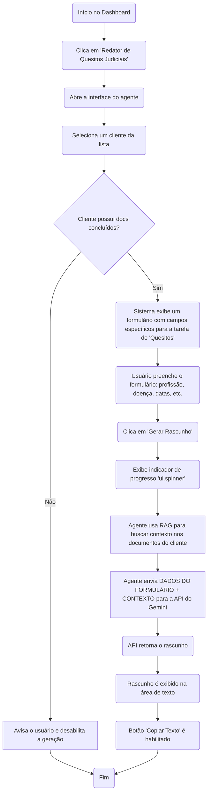

# Especificação de UI/UX: Sistema de Agentes Autônomos para Advocacia

## 1. Introdução

Este documento define os objetivos da experiência do usuário, a arquitetura da informação, os fluxos de usuário e as especificações de design visual para a interface do "Sistema de Agentes Autônomos para Advocacia". Ele servirá como a base para o design visual e o desenvolvimento frontend, garantindo uma experiência coesa e centrada no usuário.

| Data | Versão | Descrição | Autor |
| :--- | :--- | :--- | :--- |
| 25/07/2025 | 1.0 | Versão consolidada com todas as seções aprovadas. | Sally, UX Expert |

### Objetivos e Princípios Gerais de UX

Com base no PRD, estabeleci os seguintes pontos fundamentais para nossa experiência de usuário.

* **Personas de Usuário Alvo:**
    * **`sysadmin` (Administrador da Plataforma):** Focado na manutenção, monitoramento e configuração geral do sistema. Sua interface precisa ser funcional e informativa.
    * **`admin_user` (Administrador do Escritório):** Responsável por gerenciar clientes e usuários dentro do escritório. Necessita de uma visão geral e controle sobre os dados da sua organização.
    * **`common_user` (Advogado/Usuário Final):** O principal consumidor dos agentes de IA. Sua jornada deve ser extremamente eficiente, focada em executar tarefas com o mínimo de atrito.

* **Metas de Usabilidade:**
    * **Eficiência:** Permitir que um advogado vá do login à geração de um rascunho de documento no menor tempo possível.
    * **Clareza:** A interface deve fornecer feedback instantâneo e claro sobre o status de tarefas assíncronas (como o processamento de PDFs).
    * **Baixa Carga Cognitiva:** O design deve ser limpo e direto, evitando sobrecarga de informação para que o foco permaneça na tarefa a ser executada pelo agente.

* **Princípios de Design:**
    1.  **Função acima da Forma:** A prioridade é a execução de tarefas. O design deve ser profissional e limpo, sem elementos desnecessários.
    2.  **Transparência no Processamento:** O usuário deve sempre saber o que o sistema está fazendo, especialmente com tarefas que rodam em segundo plano.
    3.  **Consistência Preditiva:** Utilizar padrões de interface consistentes para que o uso de novos agentes seja intuitivo.
    4.  **Acessibilidade por Padrão:** O design deve ser acessível desde o início, atendendo ao padrão WCAG AA conforme o PRD.

## 2. Arquitetura da Informação (IA)

A IA foi projetada para ser simples e direta, refletindo o paradigma "dashboard-cêntrico" definido no PRD.

### Mapa do Site / Inventário de Telas

O diagrama abaixo ilustra as principais telas do MVP e suas relações. O "Componente de Acompanhamento de Tarefas" é um elemento flutuante ou fixo, presente em várias telas, e não uma página separada.

```mermaid
graph TD
    A[Tela de Login] --> B[Painel de Controle (Dashboard)]
    B --> C["Cadastro/Gerenciamento de Clientes"]
    B --> D["Agente de Redação de Quesitos"]

    C --> C1[Lista de Clientes]
    C1 --> C2[Detalhes do Cliente]
    C2 --> C3[Tela de Upload de Documentos]
```
### Estrutura de Navegação

* **Navegação Principal (Pós-login):** A navegação principal será realizada através de um **cabeçalho (`ui.header`)** persistente. Este cabeçalho conterá:
    * O logotipo personalizável do escritório.
    * Um link para o **Dashboard**, que funciona como a página inicial.
    * Um link para a área de **Clientes**.
    * Um menu de usuário com a opção de **Logout**.

* **Navegação Secundária:**
    * Dentro da área de "Clientes", o usuário navegará da lista de clientes para a página de detalhes de um cliente específico.
    * A funcionalidade de upload de documentos será acessada diretamente da página de detalhes do cliente.

* **Breadcrumbs (`ui.breadcrumbs`):** Para auxiliar na localização, implementaremos breadcrumbs em telas aninhadas.
    * Exemplo: `Painel de Controle > Clientes > [Nome do Cliente]`

## 3. Fluxos de Usuário

### Fluxo 1: Ingestão e Processamento de Documento

* **Objetivo do Usuário:** Enviar um documento PDF para um cliente específico, para que o sistema o processe e o prepare para consultas futuras dos agentes de IA.
* **Pontos de Entrada:** Página de "Detalhes do Cliente".
* **Critérios de Sucesso:**
    * O documento é enviado e classificado com sucesso.
    * O usuário recebe uma notificação imediata de que o processamento foi iniciado.
    * O status do documento na interface é atualizado para "Concluído" ao final do processo.
    * O sistema impede o upload de um arquivo com conteúdo duplicado para o mesmo cliente.

#### Diagrama do Fluxo:

```mermaid
graph TD
    A(Início na tela 'Detalhes do Cliente') --> B(Clica em 'Fazer Upload de Documento');
    B --> C(Seleciona arquivo PDF local);
    C --> D(Classifica o documento: 'simples' ou 'complexo');
    D --> E(Clica em 'Enviar');
    E --> F{Sistema verifica hash do conteúdo};
    F -->|Duplicata| G[Notifica usuário e interrompe];
    F -->|Arquivo Novo| H(Cria tarefa de processamento assíncrona);
    H --> I(Exibe notificação: 'Processamento iniciado');
    I --> J(Status do documento muda para 'Processando');
    J --> K[Backend executa extração (OCR se 'complexo')];
    K --> L[Backend armazena vetores no DB];
    L --> M(Interface atualiza status para 'Concluído');
    G --> Z(Fim);
    M --> Z(Fim);
```
* **Casos de Borda e Tratamento de Erros:**
    * **Falha no Upload:** Uma notificação de erro (`ui.notify`) deve aparecer se o upload falhar (ex: problema de rede).
    * **Arquivo Inválido:** O sistema deve validar se o arquivo é um PDF e informar o usuário caso não seja.
    * **Falha no Processamento:** O status do documento na interface deve mudar para "Falha", permitindo que o usuário tente novamente.

### Fluxo 2: Geração de Rascunho via Formulário Estruturado

* **Objetivo do Usuário:** Gerar um rascunho de "Quesitos Judiciais" preenchendo um formulário com dados específicos da tarefa, que o agente de IA usará em conjunto com as informações dos documentos de um cliente.
* **Pontos de Entrada:** Painel de Controle (Dashboard).
* **Critérios de Sucesso:**
    * O usuário consegue selecionar um cliente e preencher os campos do formulário (`ui.input`, `ui.select`, `ui.date`, etc.) necessários para o agente.
    * Um rascunho de alta qualidade é gerado e exibido na tela.
    * O usuário pode copiar facilmente o texto gerado.

#### Diagrama do Fluxo (Revisado):


* **Casos de Borda e Tratamento de Erros:**
    * **Validação de Formulário:** Os campos do formulário devem ter validação (ex: campos obrigatórios, formato de data correto) para garantir que o agente receba os dados necessários.
    * **Falha na API do Gemini:** A interface deve exibir uma mensagem de erro clara, sugerindo que o usuário tente novamente.
    * **Informação Insuficiente:** Se o RAG não encontrar dados relevantes, o agente deve usar primariamente os dados do formulário, mas pode indicar no resultado que informações complementares não foram encontradas nos documentos.
    * **Geração Demorada:** O uso de um `ui.spinner` ou `ui.linear_progress` continua sendo essencial.

## 4. Wireframes e Mockups

**Fonte Principal do Design:** Os designs de alta fidelidade serão desenvolvidos em uma ferramenta de design (ex: Figma) e o link será adicionado aqui. Por enquanto, os layouts conceituais abaixo servem como guia.

### Layout 1: Painel de Controle (Dashboard)

* **Propósito:** Ser o ponto de entrada principal após o login, oferecendo acesso rápido e claro aos agentes autônomos.
* **Estrutura Proposta:**
    * Um **cabeçalho (`ui.header`)** fixo no topo com o nome da aplicação e um menu de usuário para logout.
    * Uma **grade (`ui.grid`)** no corpo da página exibindo os agentes disponíveis.
    * Cada agente será representado por um **cartão (`ui.card`)** clicável, contendo um **ícone (`ui.icon`)** e um **título (`ui.label`)** descritivo (ex: "Processador de PDFs").
    * Um **componente de acompanhamento de tarefas (`ui.footer` ou `ui.page_sticky`)** ficará visível no canto da tela para mostrar o progresso de tarefas em andamento, como o processamento de documentos.

### Layout 2: Tela de Gerenciamento de Clientes

* **Propósito:** Listar, buscar e permitir o cadastro de novos clientes.
* **Estrutura Proposta:**
    * Um título claro, como "Gerenciamento de Clientes".
    * Um botão de ação principal (`ui.button`) para "Cadastrar Novo Cliente", que abrirá uma janela de diálogo (`ui.dialog`) com o formulário de cadastro.
    * Uma **tabela avançada (`ui.table`)** para listar os clientes.
        * **Colunas:** Nome, CPF, Data de Nascimento.
        * **Funcionalidades:** A tabela incluirá uma caixa de busca integrada para filtrar clientes rapidamente.

### Layout 3: Tela de Detalhes do Cliente

* **Propósito:** Exibir as informações de um cliente, listar seus documentos processados e permitir o upload de novos arquivos.
* **Estrutura Proposta:**
    * **Breadcrumbs (`ui.breadcrumbs`)** para navegação (ex: `Dashboard > Clientes > Nome do Cliente`).
    * Um **cartão de informações (`ui.card`)** no topo com os dados do cliente (Nome, CPF, etc.).
    * Uma seção "Documentos" contendo:
        * Um componente de **upload (`ui.upload`)** que permite ao usuário selecionar um arquivo PDF e classificá-lo como "simples" ou "complexo" através de um `ui.select`.
        * Uma **tabela (`ui.table`)** listando os documentos já enviados, com as colunas: Nome do Arquivo, Data do Upload e Status (com indicadores visuais).

### Layout 4: Interface do Agente (Ex: Redator de Quesitos)

* **Propósito:** Guiar o usuário no preenchimento dos dados estruturados necessários para que o agente execute sua tarefa.
* **Estrutura Proposta:**
    * Utilizaremos um **stepper (`ui.stepper`)** para dividir o processo em etapas lógicas e fáceis de seguir.
    * **Passo 1: Contexto:** O usuário seleciona o cliente desejado em um `ui.select`. O sistema valida se há documentos processados e libera o próximo passo.
    * **Passo 2: Coleta de Dados:** O sistema exibe um formulário (`ui.column` com `ui.input`, `ui.date`, etc.) com todos os campos que este agente específico requer (profissão, doença, datas, etc.). Haverá validação nos campos.
    * **Passo 3: Geração e Resultado:** Após o preenchimento, um botão "Gerar Rascunho" fica ativo. Ao clicar, a área de resultados exibe um `ui.spinner` enquanto o agente trabalha. O texto final é exibido em uma `ui.textarea` com um botão `ui.button` para "Copiar Texto".

## 5. Biblioteca de Componentes / Design System

* **Abordagem:** Começaremos com uma biblioteca de componentes interna e minimalista, focada apenas nos elementos essenciais para o MVP. Isso garante consistência e acelera o desenvolvimento. Cada componente será construído usando os elementos base do NiceGUI.

* **Componentes Essenciais:**
    * **Botão (`ui.button`):**
        * **Propósito:** Ações primárias e secundárias.
        * **Variantes:** Primário (ações principais, ex: "Gerar"), Secundário (ações de suporte, ex: "Cancelar"), Link/Plano (`.props('flat')`).
        * **Estados:** Padrão, Hover, Focado, Desabilitado (`.bind_enabled_from`).
        * **Diretriz de Uso:** Usar o botão primário apenas uma vez por área de visualização para guiar o usuário na ação principal.

    * **Campos de Formulário (`ui.input`, `ui.select`, `ui.date`):**
        * **Propósito:** Coleta de dados estruturados nos formulários dos agentes e no cadastro de clientes.
        * **Estados:** Padrão, Focado, Erro (com mensagem de validação).
        * **Diretriz de Uso:** Todos os campos devem ter um `label` claro. A validação deve ocorrer em tempo real para fornecer feedback imediato.

    * **Cartão (`ui.card`):**
        * **Propósito:** Agrupar visualmente informações relacionadas, como dados de um cliente ou a interface de um agente.
        * **Diretriz de Uso:** Usado como o principal contêiner de conteúdo para manter a interface organizada e limpa.

    * **Tabela (`ui.table`):**
        * **Propósito:** Exibir listas de dados, como clientes e documentos.
        * **Funcionalidades:** Deve incluir busca, paginação e a possibilidade de clicar em uma linha para navegar para a tela de detalhes.

    * **Notificações (`ui.notify`):**
        * **Propósito:** Fornecer feedback rápido e não obstrutivo para ações do usuário.
        * **Variantes:** Sucesso (verde), Erro (vermelho), Informação (azul).
        * **Diretriz de Uso:** Usadas para confirmar ações (ex: "Cliente cadastrado com sucesso") ou informar sobre erros.

## 6. Guia de Estilo e Identidade Visual

A identidade visual será baseada em tokens (variáveis) para permitir a personalização por cliente, um requisito chave do PRD.

* **Cores:**
    * **Paleta Base:** Uma paleta profissional e neutra (tons de cinza, branco e um azul corporativo como primário).
    * **Tokens Customizáveis:** A cor primária (botões, links, destaques) e o logotipo serão configuráveis para cada instância do sistema.
    * **Cores Semânticas:** Cores fixas serão usadas para estados do sistema:
        * **Sucesso:** Verde (para notificações de sucesso, status "Concluído").
        * **Aviso:** Amarelo (para status "Processando").
        * **Erro:** Vermelho (para notificações de falha, erros de validação, status "Falha").

* **Tipografia:**
    * **Fonte:** Uma fonte sans-serif limpa e de alta legibilidade (ex: Inter, Lato) será usada em toda a aplicação para garantir uma leitura confortável.
    * **Escala:** Uma escala tipográfica clara será definida para títulos (`H1`, `H2`), subtítulos e corpo de texto, garantindo hierarquia visual.

* **Iconografia:**
    * **Biblioteca:** Utilizaremos um conjunto de ícones padrão e de código aberto (ex: Material Icons, fornecido pelo Quasar/NiceGUI) para garantir consistência visual.

* **Espaçamento e Layout:**
    * **Grade:** Um sistema de espaçamento baseado em uma grade de 8px será usado para todos os preenchimentos (padding) e margens, criando um layout harmonioso e consistente.

## 7. Requisitos de Acessibilidade

* **Meta de Conformidade:** O produto deve atender, no mínimo, ao padrão **WCAG AA**, conforme especificado no PRD.
* **Requisitos Chave:**
    * **Visual:**
        * **Contraste de Cores:** Todas as combinações de texto e fundo devem atender a uma taxa de contraste mínima de 4.5:1.
        * **Indicadores de Foco:** Elementos interativos (links, botões, campos de formulário) devem ter um indicador de foco claro e visível quando navegados via teclado.
    * **Interação:**
        * **Navegação por Teclado:** A aplicação deve ser totalmente navegável e operável usando apenas o teclado.
        * **Suporte a Leitores de Tela:** Elementos não textuais, como ícones, devem ter rótulos apropriados (ARIA labels) para serem compreendidos por leitores de tela.
    * **Conteúdo:**
        * **Rótulos de Formulário:** Todos os campos de formulário devem estar associados a um `ui.label`.
        * **Estrutura Semântica:** O HTML gerado deve usar uma estrutura de cabeçalhos lógica para facilitar a navegação.

## 8. Estratégia de Responsividade

* **Requisito:** A aplicação deve ser totalmente funcional em desktops, tablets e celulares.
* **Abordagem:** Utilizaremos uma abordagem "mobile-first", onde o design base é para telas pequenas, e expandimos para telas maiores usando os prefixos de ponto de interrupção do Tailwind CSS (`md:`, `lg:`), que são nativamente suportados pelo NiceGUI.
* **Pontos de Interrupção (Breakpoints):**
    * **Mobile:** < 768px
    * **Tablet:** >= 768px
    * **Desktop:** >= 1024px
* **Padrões de Adaptação:**
    * **Grades (`ui.grid`):** Em telas mobile, os cartões de agentes no Dashboard serão empilhados em uma única coluna. Em telas maiores, se transformarão em uma grade com múltiplas colunas.
    * **Tabelas (`ui.table`):** Em telas muito pequenas, colunas menos críticas podem ser ocultadas para evitar a rolagem horizontal excessiva.
    * **Navegação:** Em telas mobile, a navegação principal do `ui.header` será recolhida em um menu "hambúrguer" que aciona um `ui.left_drawer`, uma prática padrão para otimizar o espaço e melhorar a usabilidade.

## 9. Animação e Microinterações

* **Princípios:** As animações serão sutis e funcionais, focadas em fornecer feedback ao usuário e melhorar a percepção de usabilidade, sem causar distração.
* **Microinterações Chave:**
    * **Feedback de Ação:** Botões e elementos clicáveis terão uma transição suave no estado de hover/clique.
    * **Indicadores de Carregamento:** O uso de `ui.spinner` e `ui.linear_progress` será padronizado para indicar todas as operações em andamento.
    * **Notificações:** As notificações (`ui.notify`) aparecerão e desaparecerão com uma transição suave.

## 10. Considerações de Performance

* **Metas:** A interface deve carregar rapidamente e responder instantaneamente às interações do usuário.
* **Estratégias de Design:**
    * **Carregamento Percebido:** Em áreas onde os dados podem demorar a carregar (como a lista de documentos de um cliente), usaremos placeholders de carregamento (`ui.skeleton`) para que a interface pareça responsiva mesmo antes de os dados chegarem.
    * **Renderização Otimizada:** Utilizaremos o padrão `@ui.refreshable` do NiceGUI para atualizar apenas as partes da UI que mudam, em vez de recarregar a página inteira, como na lista de tarefas de processamento.

## 11. Próximos Passos

* **Ações Imediatas:**
    1.  Revisão final deste documento com a equipe.
    2.  Criação dos mockups de alta fidelidade em uma ferramenta de design.
    3.  **Handoff para o Arquiteto (Winston)** para refinar o `architecture.md` com os detalhes técnicos do frontend e garantir o alinhamento.

* **Checklist de Handoff para Arquitetura:**
    * [x] Fluxos de usuário definidos.
    * [x] Inventário de componentes essenciais completo.
    * [x] Requisitos de acessibilidade definidos (WCAG AA).
    * [x] Estratégia de responsividade clara (mobile-first).
    * [x] Requisito de identidade visual personalizável documentado.
    * [x] Metas de performance estabelecidas.
