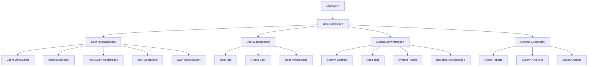
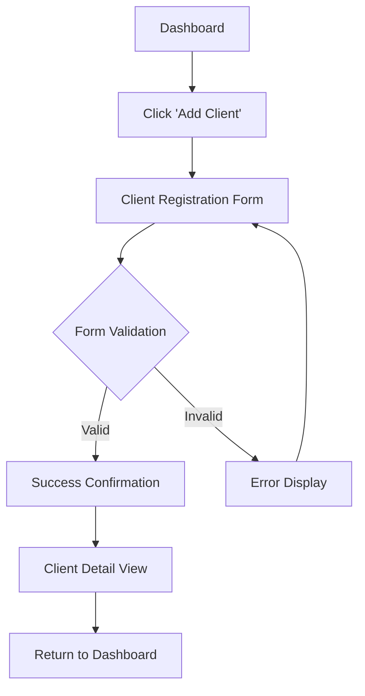
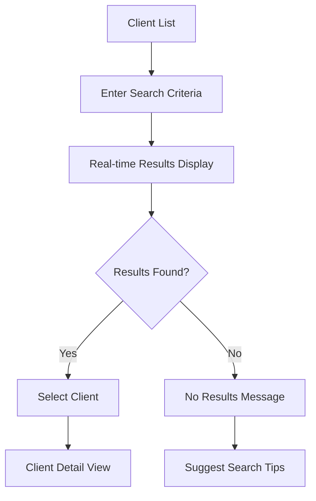
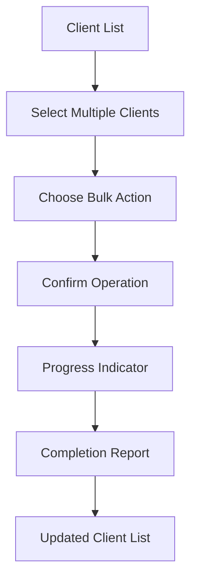

# Multi-Agent IAM Dashboard - Front-End Specification

*Generated on August 1, 2025 - Version 1.0*

---

## 1. Introduction

### Project Context

The Multi-Agent IAM Dashboard is a **Custom Implementation Service** delivering dedicated VPS instances with independent AI agents for client management automation. This specification defines the user experience and interface design for a professional, enterprise-grade platform that reflects each client's unique brand identity while maintaining exceptional usability and accessibility standards.

### Target User Personas

#### Primary Persona: Business Administrator
- **Role**: Admin/User managing daily client operations
- **Goals**: Efficiently register, search, and manage client information
- **Pain Points**: Time-consuming manual data entry, difficulty finding specific clients
- **Tech Comfort**: Moderate to high - comfortable with web applications
- **Device Usage**: Primarily desktop, occasional tablet/mobile access

#### Secondary Persona: System Administrator  
- **Role**: Sysadmin managing user accounts and system configuration
- **Goals**: Maintain system security, manage user permissions, monitor system health
- **Pain Points**: Complex user management, system monitoring across multiple instances
- **Tech Comfort**: High - expects advanced functionality and detailed controls
- **Device Usage**: Desktop-focused with mobile monitoring capabilities

#### Tertiary Persona: Service Provider
- **Role**: Managing multiple client implementations and custom branding
- **Goals**: Efficiently deploy and customize client instances, monitor service health
- **Pain Points**: Managing multiple concurrent implementations, consistent branding deployment
- **Tech Comfort**: Very high - technical implementation and configuration
- **Device Usage**: Desktop with multi-monitor setups

### UX Goals & Principles

#### Primary UX Goals
1. **Professional Enterprise Experience**: Interface conveys trustworthiness and sophistication suitable for client presentation
2. **Brand Flexibility**: Complete visual customization reflecting each client's unique identity
3. **Workflow Efficiency**: Streamlined processes reducing time for common tasks by 50%
4. **Universal Accessibility**: WCAG AA compliance ensuring usability for all users
5. **Responsive Excellence**: Consistent functionality across all device sizes

#### Core Design Principles
1. **User-Centric Above All**: Every design decision serves user needs and reduces cognitive load
2. **Simplicity Through Iteration**: Progressive disclosure revealing complexity only when needed  
3. **Delight in Details**: Thoughtful micro-interactions creating memorable, professional experiences
4. **Design for Real Scenarios**: Consider edge cases, error states, and loading conditions
5. **Consistency with Flexibility**: Maintain usability patterns while allowing brand customization

### Change Log

| Date | Version | Description | Author |
|------|---------|-------------|---------|
| 2025-08-01 | 1.0 | Initial front-end specification from PRD analysis | Sally (UX Expert) |

---

## 2. Information Architecture

### Site Map & Screen Inventory



### Navigation Structure

#### Primary Navigation (Left Sidebar)
- **Dashboard**: Overview and quick actions
- **Clients**: Client management hub with sub-navigation
- **Users**: User administration (sysadmin/admin only)
- **System**: Configuration and monitoring (admin+ only)
- **Reports**: Analytics and export functions

#### Secondary Navigation (Within Sections)
- **Breadcrumb Navigation**: Always visible showing current location
- **Tab-based Sub-sections**: For complex areas like Client Management
- **Action-based Navigation**: Context-sensitive actions in toolbars

#### Mobile Navigation
- **Collapsible Hamburger Menu**: Space-efficient primary navigation
- **Bottom Tab Bar**: Quick access to most-used functions
- **Swipe Gestures**: Natural mobile navigation patterns

---

## 3. User Flows

### Critical User Task Flows

#### Flow 1: New Client Registration


**Entry Points**: Dashboard quick action, Client list "Add" button, direct URL
**Success Criteria**: Client successfully registered with valid SSN, confirmation message displayed
**Edge Cases**: Duplicate SSN, invalid birthdate, network errors

#### Flow 2: Client Search & Filter


**Entry Points**: Client list page, dashboard search widget
**Success Criteria**: Relevant results in <500ms, clear result count
**Edge Cases**: No results, network timeout, partial matches

#### Flow 3: Bulk Operations


**Entry Points**: Client list with selection checkboxes
**Success Criteria**: Clear progress tracking, success/failure reporting
**Edge Cases**: Partial failures, operation cancellation, large datasets

---

## 4. Wireframes & Key Screen Layouts

### Login/Authentication Screen
```
┌─────────────────────────────────────────┐
│  [LOGO]           Company Name          │
├─────────────────────────────────────────┤
│                                         │
│    ┌─────────────────────────────────┐  │
│    │         Login Form              │  │
│    │  Email: [________________]      │  │
│    │  Password: [____________]       │  │
│    │  [ ] Remember me                │  │
│    │  [Login Button]                 │  │
│    │  Forgot password?               │  │
│    └─────────────────────────────────┘  │
│                                         │
│    2FA Code (if enabled):              │
│    [______] - [______] - [______]      │
│    [Verify Button]                     │
│                                         │
└─────────────────────────────────────────┘
```

### Main Dashboard Layout
```
┌─────────────────────────────────────────────────────────────┐
│ [LOGO] Dashboard        [User Menu] [Notifications] [Help] │
├─────────────────────────────────────────────────────────────┤
│ Nav │                                                      │
│ ├── │  ┌─────────────┐ ┌─────────────┐ ┌─────────────┐    │
│ │D  │  │Total Clients│ │New This Week│ │System Health│    │
│ │a  │  │    1,247    │ │     23      │ │   99.9%     │    │
│ │s  │  └─────────────┘ └─────────────┘ └─────────────┘    │
│ │h  │                                                      │
│ ├── │  Recent Activity Feed:                               │
│ │C  │  • John Doe registered (2 min ago)                  │
│ │l  │  • Client search performed (5 min ago)              │
│ │i  │  • Bulk export completed (10 min ago)               │
│ │e  │                                                      │
│ │n  │  Quick Actions:                                      │
│ │t  │  [+ Add Client] [Search] [Import CSV] [Export]      │
│ │s  │                                                      │
│ ├── │                                                      │
│ │U  │                                                      │
│ │s  │                                                      │
│ │e  │                                                      │
│ │r  │                                                      │
│ │s  │                                                      │
│     │                                                      │
└─────────────────────────────────────────────────────────────┘
```

### Client Management Interface
```
┌─────────────────────────────────────────────────────────────┐
│ Clients > List                    [+ Add Client] [Import]   │
├─────────────────────────────────────────────────────────────┤
│ Search: [________________] 🔍                               │
│ Filters: [All] [Active] [Recent] [Date Range: _____ to ___]│
├─────────────────────────────────────────────────────────────┤
│ □ │ Name           │ SSN         │ Birth Date │ Actions     │
│ □ │ John Doe       │ ***-**-1234 │ 01/15/1985 │ [Edit][Del]│
│ □ │ Jane Smith     │ ***-**-5678 │ 03/22/1990 │ [Edit][Del]│
│ □ │ Bob Johnson    │ ***-**-9012 │ 07/08/1978 │ [Edit][Del]│
├─────────────────────────────────────────────────────────────┤
│ 3 of 1,247 clients   Bulk Actions: [Export] [Delete]      │
│ [< Previous] [1][2][3]...[42] [Next >]                     │
└─────────────────────────────────────────────────────────────┘
```

### Client Detail/Edit Screen
```
┌─────────────────────────────────────────────────────────────┐
│ Clients > John Doe                           [Edit] [Delete]│
├─────────────────────────────────────────────────────────────┤
│ Personal Information:                                       │
│ Name: [John Doe___________________] ✓                       │
│ SSN:  [123-45-6789_______________] ✓ (Validated)          │
│ Birth Date: [01/15/1985_________] ✓                        │
│ Status: [Active ▼]                                         │
│                                                             │
│ Audit History:                                              │
│ • Created by admin@company.com on 2025-07-15 14:30        │
│ • Last modified by user@company.com on 2025-07-28 09:15   │
│                                                             │
│ [Save Changes] [Cancel] [View History]                     │
└─────────────────────────────────────────────────────────────┘
```

---

## 5. Component Library & Design System

### Design System Approach

The system uses **shadcn/ui** components with **Tailwind CSS** for a modern, customizable design system that supports complete brand flexibility through CSS variables.

### Core Component Specifications

#### Primary Components

**Button Components**
- **Primary Button**: Main call-to-action styling with hover states
- **Secondary Button**: Supporting actions with outline styling  
- **Danger Button**: Destructive actions with warning colors
- **Icon Button**: Compact actions with icon-only display
- **Loading Button**: Progress indicators for async operations

**Form Components**
- **Text Input**: Standard text fields with validation states
- **Select Dropdown**: Single and multi-select options
- **Date Picker**: Standardized date input with calendar popup
- **Checkbox/Radio**: Selection controls with indeterminate states
- **File Upload**: Drag-and-drop with progress indicators

**Data Display Components**
- **Data Table**: Sortable, filterable tables with pagination
- **Card Layout**: Information containers with consistent spacing
- **Stats Widget**: Metric display with trend indicators
- **Progress Bar**: Visual progress indication for operations
- **Badge/Tag**: Status and category labels

#### Component States & Variants

**Interactive States**
- Default, Hover, Active, Disabled, Loading
- Focus states with keyboard navigation support
- Error states with validation messaging

**Size Variants**
- Small (mobile-optimized), Medium (default), Large (desktop)
- Consistent sizing scale across all components

**Brand Variants**
- All components adapt to custom color schemes via CSS variables
- Typography variants supporting custom font selections

---

## 6. Branding & Style Guide

### Custom Branding System Architecture

The platform implements **complete visual customization** through CSS variables, allowing each client implementation to reflect their unique brand identity.

### Core Color Palette Structure

| Color Role | CSS Variable | Default Value | Usage |
|------------|--------------|---------------|--------|
| Primary | `--primary` | `222.2 47.4% 11.2%` | Main brand color for buttons, links |
| Primary Foreground | `--primary-foreground` | `210 40% 98%` | Text on primary backgrounds |
| Secondary | `--secondary` | `210 40% 96.1%` | Supporting elements |
| Background | `--background` | `0 0% 100%` | Main page background |
| Foreground | `--foreground` | `222.2 47.4% 11.2%` | Primary text color |
| Muted | `--muted` | `210 40% 96.1%` | Subtle backgrounds |
| Border | `--border` | `214.3 31.8% 91.4%` | Component borders |
| Destructive | `--destructive` | `0 62.8% 30.6%` | Error/delete actions |
| Success | `--success` | `142.1 76.2% 36.3%` | Success states |
| Warning | `--warning` | `47.9 95.8% 53.1%` | Warning states |

### Typography Scale

| Scale | CSS Variable | Default | Usage |
|--------|--------------|---------|--------|
| Base Font | `--font-sans` | 'Inter', system-ui | Body text and interface |
| Monospace | `--font-mono` | 'JetBrains Mono' | Code and data display |
| Heading XL | `text-4xl` | 36px/40px | Page titles |
| Heading L | `text-3xl` | 30px/36px | Section headers |
| Heading M | `text-xl` | 20px/28px | Component titles |
| Body L | `text-lg` | 18px/28px | Important body text |
| Body M | `text-base` | 16px/24px | Standard body text |
| Body S | `text-sm` | 14px/20px | Supporting text |
| Caption | `text-xs` | 12px/16px | Labels and captions |

### Approved Font Families for Customization

**Professional Sans-Serif Options**
- Inter (default) - Modern, highly legible
- Source Sans Pro - Clean, professional
- Open Sans - Friendly, approachable
- Roboto - Material Design aesthetic
- Nunito Sans - Rounded, modern

**Professional Serif Options** (for branded headers)
- Source Serif Pro - Traditional elegance
- Playfair Display - Editorial sophistication
- Lora - Readable serif for digital

### Iconography Guidelines

**Icon System**: Lucide React icons for consistency
**Icon Sizes**: 16px (small), 20px (medium), 24px (large), 32px (extra large)
**Icon Style**: Outline style for consistency, filled variants for selected states
**Custom Icons**: SVG format, optimized for performance, consistent stroke width

### Spacing & Layout System

**Spatial Scale** (based on 4px grid)
- `spacing-1`: 4px - Tight spacing
- `spacing-2`: 8px - Component internal spacing  
- `spacing-3`: 12px - Related element spacing
- `spacing-4`: 16px - Standard component spacing
- `spacing-6`: 24px - Section spacing
- `spacing-8`: 32px - Large section spacing
- `spacing-12`: 48px - Page section spacing

**Layout Radius**
- `--radius`: 0.5rem (8px) - Default border radius (customizable)
- Component radius scales: 0.25rem, 0.5rem, 0.75rem, 1rem

---

## 7. Accessibility Requirements

### WCAG AA Compliance Targets

The platform must meet **WCAG AA standards** across all functionality, ensuring professional accessibility for enterprise environments.

#### Visual Accessibility Requirements

**Color Contrast**
- Normal text: Minimum 4.5:1 contrast ratio
- Large text (18pt+): Minimum 3:1 contrast ratio  
- UI components: Minimum 3:1 contrast for borders and states
- Custom branding validation ensures all color schemes meet requirements

**Visual Indicators**
- No information conveyed by color alone
- Focus indicators visible on all interactive elements
- Visual feedback for all user actions and system states

#### Interaction Accessibility Requirements

**Keyboard Navigation**
- All functionality accessible via keyboard only
- Logical tab order throughout all interfaces
- Visible focus indicators with 2px minimum outline
- Escape key support for modal dialogs and overlays

**Screen Reader Support**
- Semantic HTML structure throughout
- ARIA labels for all interactive elements
- Table headers properly associated with data
- Form labels explicitly connected to inputs
- Skip links for main content areas

#### Content Accessibility Requirements

**Language & Reading**
- Clear, plain language for all interface text
- Consistent terminology throughout the platform
- Error messages provide clear guidance for resolution
- Instructions precede form sections requiring them

**Form Accessibility**
- Descriptive field labels always visible
- Required fields clearly marked
- Validation errors associated with specific fields
- Group related fields with fieldset elements

### Accessibility Testing Strategy

**Automated Testing**
- axe-core integration in development pipeline
- Lighthouse accessibility audits on all major workflows
- Color contrast validation for custom branding configurations

**Manual Testing**
- Keyboard-only navigation testing
- Screen reader testing with NVDA/JAWS
- High contrast mode validation
- Zoom testing up to 200% magnification

---

## 8. Responsiveness Strategy

### Breakpoint Definitions

```css
/* Mobile First Approach */
/* Small devices (phones) */
@media (min-width: 640px) { /* sm */ }

/* Medium devices (tablets) */  
@media (min-width: 768px) { /* md */ }

/* Large devices (laptops) */
@media (min-width: 1024px) { /* lg */ }

/* Extra large devices (desktops) */
@media (min-width: 1280px) { /* xl */ }

/* 2XL devices (large desktops) */
@media (min-width: 1536px) { /* 2xl */ }
```

### Device-Specific Adaptations

#### Mobile (320px - 639px)
**Navigation**: Hamburger menu with full-screen overlay
**Data Tables**: Horizontal scroll with fixed first column
**Forms**: Single column layout with large touch targets (44px min)
**Dashboard**: Stacked cards with essential metrics only
**Actions**: Bottom sheet for contextual actions

#### Tablet (640px - 1023px)  
**Navigation**: Collapsible sidebar that overlays content
**Data Tables**: Responsive table with hide/show columns
**Forms**: Two-column layout for efficiency
**Dashboard**: 2x2 grid layout for metric cards
**Actions**: Floating action button for primary actions

#### Desktop (1024px+)
**Navigation**: Persistent left sidebar with full navigation
**Data Tables**: Full table with all columns visible
**Forms**: Optimized layout with contextual help
**Dashboard**: Full grid layout with comprehensive widgets
**Actions**: Inline actions and dropdown menus

### Responsive Component Patterns

**Progressive Enhancement**
- Mobile-first CSS with desktop enhancements
- Touch-friendly interactions scale down gracefully
- Content hierarchy maintained across all sizes

**Adaptive Content**
- Essential information prioritized on smaller screens
- Progressive disclosure reveals more details on larger screens
- Context-sensitive navigation based on screen real estate

---

## 9. Animation & Micro-interactions

### Motion Design Principles

**Purposeful Motion**: Every animation serves a functional purpose
**Natural Feel**: Easing curves that feel physically realistic
**Performance**: 60fps animations using CSS transforms
**Respectful**: Honor user preferences for reduced motion

### Key Animation Specifications

#### Page Transitions
```css
/* Fade in new content */
.page-enter {
  opacity: 0;
  transform: translateY(8px);
  transition: all 0.2s ease-out;
}

.page-enter-active {
  opacity: 1;
  transform: translateY(0);
}
```

#### Interactive Feedback
```css
/* Button hover state */
.button {
  transition: all 0.15s ease-out;
  transform: translateY(0);
}

.button:hover {
  transform: translateY(-1px);
  box-shadow: 0 4px 12px rgba(0,0,0,0.15);
}

/* Loading states */
.loading-spinner {
  animation: spin 1s linear infinite;
}
```

#### Data State Changes
- **New Client Added**: Gentle fade-in with slide from top
- **Client Updated**: Subtle color pulse to indicate change
- **Bulk Operations**: Progress bar with smooth transitions
- **Search Results**: Staggered animation (50ms delay per item)

### Micro-interaction Details

**Form Validation**
- Real-time validation with 300ms debounce
- Success states with gentle green pulse
- Error states with subtle red border animation

**Navigation Feedback**
- Active page indicator slides smoothly between items
- Hover states provide immediate visual feedback
- Loading states for async operations

**Data Interactions**
- Table row highlighting on hover
- Smooth expansion for detailed views
- Contextual actions appear on interaction

---

## 10. Performance Considerations

### UX-Impacting Performance Goals

#### Page Load Performance
- **First Contentful Paint**: < 1.5 seconds
- **Largest Contentful Paint**: < 2.5 seconds  
- **Time to Interactive**: < 3.5 seconds
- **Cumulative Layout Shift**: < 0.1

#### Runtime Performance
- **Search Results**: < 500ms response time
- **Form Validation**: < 200ms feedback
- **Navigation**: < 100ms transition timing
- **Data Export**: Progress indicators for operations > 2 seconds

### Performance UX Strategies

**Loading States**
- Skeleton screens for data-heavy views
- Progressive loading for large datasets
- Optimistic UI updates for immediate feedback

**Caching Strategy**
- Client-side caching for frequently accessed data
- Service worker for offline functionality
- Intelligent prefetching for likely user actions

**Image Optimization**
- WebP format with fallbacks
- Responsive images for different viewport sizes
- Lazy loading for below-the-fold content

---

## 11. Implementation Priorities & Next Steps

### Phase 1: Foundation (Weeks 1-2)
**Immediate Actions:**
1. Set up design system with shadcn/ui and Tailwind CSS
2. Implement responsive navigation structure
3. Create authentication screens with 2FA support
4. Build basic dashboard layout with placeholder components

**Design Handoff Checklist:**
- [ ] Component library documented in Storybook
- [ ] CSS variable system implemented for branding
- [ ] Responsive breakpoints configured
- [ ] Accessibility testing setup configured

### Phase 2: Core Functionality (Weeks 3-4)
**Development Priorities:**
1. Client management interfaces (list, detail, edit)
2. Search and filtering functionality
3. Form components with validation
4. Data table with sorting and pagination

### Phase 3: Advanced Features (Weeks 5-6)
**Final Implementation:**
1. Bulk operations interface
2. CSV import/export functionality
3. User management screens
4. System administration interfaces

### Phase 4: Polish & Testing (Weeks 7-8)
**Quality Assurance:**
1. Comprehensive accessibility testing
2. Cross-browser compatibility validation
3. Performance optimization
4. Custom branding system validation

---

## 12. Technical Integration Notes

### Framework Integration
- **Next.js 15 + React 19**: Server Components by default, Client Components for interactivity
- **TypeScript**: Strict mode with comprehensive type definitions
- **shadcn/ui**: Component foundation with custom theme system
- **Tailwind CSS**: Utility-first styling with CSS variable integration

### Custom Branding Implementation
```css
/* CSS Variable System for Brand Customization */
:root {
  --primary: 222.2 47.4% 11.2%;
  --primary-foreground: 210 40% 98%;
  --brand-logo: url('/client-assets/logo.svg');
  --brand-font: 'Inter', system-ui, sans-serif;
}

/* Component adapts automatically */
.btn-primary {
  background-color: hsl(var(--primary));
  color: hsl(var(--primary-foreground));
}
```

### State Management
- **React Context**: Authentication and user state
- **TanStack Query**: Server state management and caching
- **React Hook Form**: Form state with Zod validation
- **Local Storage**: User preferences and session persistence

---

*Front-end specification completed on August 1, 2025*  
*Ready for development team handoff and implementation*

---

**Document Status**: ✅ Complete  
**Next Phase**: Technical Architecture & Implementation Planning  
**Estimated Implementation**: 8 weeks with 2-person frontend team